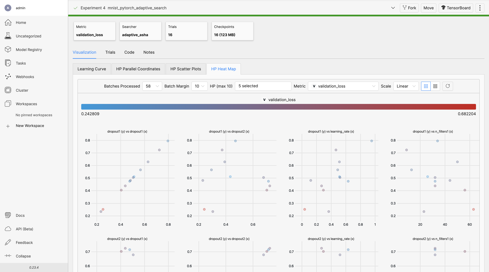

<p align="center"></p>

Determined is an all-in-one deep learning platform, compatible with PyTorch and TensorFlow.

It takes care of:

- Distributed training for faster results.
- Hyperparameter tuning for obtaining the best models.
- Resource management for cutting cloud GPU costs.
- Experiment tracking for analysis and reproducibility.


# How Determined Works

The main components of Determined are the Python library, the command line interface (CLI), and the Web UI.

## Python Library
Use the Python library to make your existing PyTorch or Tensorflow code compatible with Determined. 

You can do this by organizing your code into one of the class-based APIs:

```python
from determined.pytorch import PyTorchTrial

class YourExperiment(PyTorchTrial):
  def __init__(self, context):
    ...
```

Or by using just the functions you want, via the Core API:

```python
import determined as det

with det.core.init() as core_context:
    ...
```

## Command Line Interface (CLI)

You can use the CLI to:

- Start a Determined cluster locally:

```
det deploy local cluster-up
```

- Launch Determined on cloud services, such as Amazon Web Services (AWS) or Google Cloud Platform (GCP):

```
det deploy aws up
```


- Train your models:
```bash
det experiment create gpt.yaml .
```

Configure everything from distributed training to hyperparameter tuning using YAML files:

```yaml
resources:
  slots_per_trial: 8
  priority: 1
hyperparameters:
  learning_rate:
    type: double
    minval: .0001
    maxval: 1.0
searcher:
  name: adaptive_asha
  metric: validation_loss
  smaller_is_better: true
```


## Web UI

Use the Web UI to view loss curves, hyperparameter plots, code and configuration snapshots, model registries, cluster utilization, debugging logs, performance profiling reports, and more.




# Installation

To install the CLI:
```bash
pip install determined
```

Then use `det deploy` to start the Determined cluster locally, or on cloud services like AWS and GCP.

For installation details, visit the the cluster deployment guide for your environment:

- [Local (on-prem)](https://docs.determined.ai/latest/setup-cluster/deploy-cluster/on-prem/overview.html)
- [AWS](https://docs.determined.ai/latest/setup-cluster/deploy-cluster/aws/overview.html)
- [GCP](https://docs.determined.ai/latest/setup-cluster/deploy-cluster/gcp/overview.html)
- [Kubernetes](https://docs.determined.ai/latest/setup-cluster/deploy-cluster/k8s/overview.html)
- [Slurm/PBS](https://docs.determined.ai/latest/setup-cluster/deploy-cluster/slurm/overview.html)

# Documentation

* [Documentation](https://docs.determined.ai)
* [Quick Start Guide](https://docs.determined.ai/latest/getting-started.html)
* Tutorials:
  * [PyTorch MNIST Tutorial](https://docs.determined.ai/latest/tutorials/pytorch-mnist-tutorial.html)
  * [TensorFlow Keras MNIST Tutorial](https://docs.determined.ai/latest/tutorials/tf-mnist-tutorial.html)
* User Guides:
  * [Core API](https://docs.determined.ai/latest/model-dev-guide/apis-howto/api-core-ug.html)
  * [PyTorch API](https://docs.determined.ai/latest/model-dev-guide/apis-howto/api-pytorch-ug.html)
  * [Keras API](https://docs.determined.ai/latest/model-dev-guide/apis-howto/api-keras-ug.html)
  * [DeepSpeed API](https://docs.determined.ai/latest/model-dev-guide/apis-howto/deepspeed/overview.html)


# Community

If you need help, want to file a bug report, or just want to keep up-to-date
with the latest news about Determined, please join the Determined community!

* [Slack](https://determined-community.slack.com) is the best place to
  ask questions about Determined and get support. [Click here to join our Slack](
  https://join.slack.com/t/determined-community/shared_invite/zt-cnj7802v-KcVbaUrIzQOwmkmY7gP0Ew).
* You can also follow us on [YouTube](https://www.youtube.com/@DeterminedAI) and [Twitter](https://www.twitter.com/DeterminedAI).
* You can also join the [community mailing list](https://groups.google.com/a/determined.ai/forum/#!forum/community)
  to ask questions about the project and receive announcements.
* To report a bug, [open an issue](https://github.com/determined-ai/determined/issues) on GitHub.
* To report a security issue, email [`security@determined.ai`](mailto:security@determined.ai).

# Contributing

[Contributor's Guide](CONTRIBUTING.md)

# License

[Apache V2](LICENSE)
