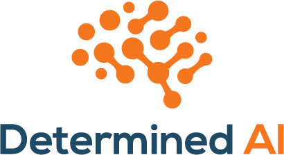

<p align="center"></p>

# Determined: Deep Learning Training Platform

Determined is an open-source deep learning training platform that makes building
models fast and easy. Determined enables you to:

- **Train models faster** using state-of-the-art distributed training, without
  changing your model code
- **Automatically find high-quality models** with advanced hyperparameter tuning
  from the creators of Hyperband
- **Get more from your GPUs** with smart scheduling and cut cloud GPU costs by
  seamlessly using preemptible instances
- **Track and reproduce your work** with experiment tracking that works
  out-of-the-box, covering code versions, metrics, checkpoints, and
  hyperparameters

Determined integrates these features into an easy-to-use, high-performance deep
learning environment — which means you can spend your time building models
instead of managing infrastructure.

To use Determined, you can continue using popular DL frameworks such as
TensorFlow and PyTorch; you just need to update your model code to integrate
with the Determined API.

:sparkles: _Want to learn more? Join us on the 26th at 2pm PT for our [Lunch & Learn](https://www.eventbrite.com/e/lunch-learn-scalable-object-detection-with-determined-tickets-133386266915) where we'll walk through how to train Facebook's DEtection TRansformers ([DETR](https://github.com/facebookresearch/detr)) model with Determined!_ :sparkles:

## Try out Determined Locally
 
Follow [these instructions](https://docs.determined.ai/latest/how-to/installation/requirements.html#install-docker) to install and set up docker.

 ```bash

# Start a Determined cluster locally
python3.7 -m venv ~/.virtualenvs/test
. ~/.virtualenvs/test/bin/activate
pip install determined-cli determined-deploy
det-deploy local cluster-up --no-gpu
## Access web UI at localhost:8080. By default, "determined" user accepts a blank password.
 
# Navigate to a Determined example
git clone https://github.com/determined-ai/determined
cd determined/examples/computer_vision/cifar10_pytorch

# Submit job to train a single model on a single GPU 
det experiment create const.yaml . 
 ```

## Detailed Installation Guide

See [our installation guide](https://docs.determined.ai/latest/how-to/install-main.html) for details on how to install Determined, including on AWS and GCP.

### Try Now on AWS

[](https://console.aws.amazon.com/cloudformation/home?region=us-west-2#/stacks/create/review?templateURL=https://determined-ai-public.s3-us-west-2.amazonaws.com/simple.yaml)

## Next Steps

For a brief introduction to using Determined, check out our
[Quick Start Guide](https://docs.determined.ai/latest/tutorials/quick-start.html).

To use an existing deep learning model with Determined, follow the
tutorial for your preferred deep learning framework:

* [PyTorch MNIST Tutorial](https://docs.determined.ai/latest/tutorials/pytorch-mnist-tutorial.html)
* [TensorFlow Keras MNIST Tutorial](https://docs.determined.ai/latest/tutorials/tf-mnist-tutorial.html)

## Documentation

The documentation for the latest version of Determined can always be found
[here](https://docs.determined.ai).

## Community

If you need help, want to file a bug report, or just want to keep up-to-date
with the latest news about Determined, please join the Determined community!

* [Slack](https://determined-community.slack.com) is the best place to
  ask questions about Determined and get support. [Click here to join our Slack](
  https://join.slack.com/t/determined-community/shared_invite/zt-cnj7802v-KcVbaUrIzQOwmkmY7gP0Ew).
* You can also join the [community mailing list](https://groups.google.com/a/determined.ai/forum/#!forum/community)
  to ask questions about the project and receive announcements.
* To report a bug, [file an issue](https://github.com/determined-ai/determined/issues) on GitHub.
* To report a security issue, email [`security@determined.ai`](mailto:security@determined.ai).

## Contributing

[Contributor's Guide](CONTRIBUTING.md)

## License

[Apache V2](LICENSE)
