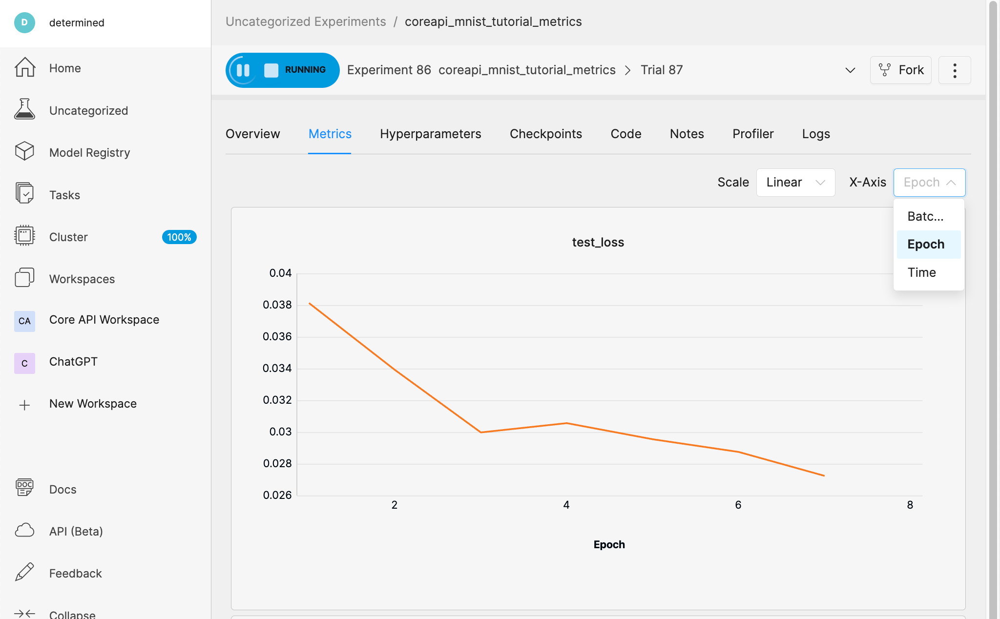

.. _coreapi-epoch-metrics-howto:

##############################################
 How to View Epoch-Based Metrics in the WebUI
##############################################

.. meta::
   :description: Learn how to analyze and visualize training progress and validation performance over multiple epochs using the Core API.
   :keywords: CoreAPI, WebUI, epochs, metrics, metric data

Sometimes, you want to analyze and visualize your model's training progress and validation
performance over multiple epochs.

In this article, we'll show you how to view epoch-based metric data in the WebUI by reporting an
epoch metric to the Determined master via the Core API. To do this, we'll define an epoch metric and
use it as the X-Axis label in the WebUI.

**Recommended**

-  :doc:`Quickstart for Model Developers <../tutorials/quickstart-mdldev>`
-  :doc:`Core API User Guide <../model-dev-guide/apis-howto/api-core-ug>`

**********************************
 Set Up Your Training Environment
**********************************

To begin, you'll need a Determined cluster. If you are new to Determined AI (Determined), you can
install the Determined library and start a cluster locally.

-  Ensure you have Docker running and then run the following command:

.. code::

   pip install determined

   # If your machine has GPUs:
   det deploy local cluster-up

   # If your machine does not have GPUs:
   det deploy local cluster-up --no-gpu

.. include:: ../_shared/note-pip-install-determined.txt

*****************************************************
 Step 1: Get the Tutorial Files & Run the Experiment
*****************************************************

To follow along, you'll need the tutorial files.

-  Create a new directory.

-  Access the tutorial files via the :download:`core_api_pytorch_mnist.tgz
   </examples/core_api_pytorch_mnist.tgz>` download link or directly from the `Github repository
   <https://github.com/determined-ai/determined/tree/master/examples/tutorials/core_api_pytorch_mnist>`_.

For this step, we'll use our ``model_def.py`` script and its accompanying ``const.yaml`` experiment
configuration file.

-  From the directory containing our files, we'll begin by running the following command:

.. code:: bash

   det e create const.yaml . -f

We don't have any data to plot yet, but we'll open the Determined WebUI to see that our experiment
is running.

-  To do this, we'll go to ``http://localhost:8080/``.
-  To sign in, we'll accept the default determined username, leave the password empty, and then
   click **Sign In**.
-  In the WebUI, we'll select our experiment, and then go to the **Logs** tab.

************************************
 Step 2: Report Epoch-Based Metrics
************************************

In this section, we'll define our epoch metric.

-  To follow along, use the ``model_def_metrics.py`` script and its accompanying ``metrics.yaml``
   experiment configuration file.

Our script, ``model_def_metrics.py``, is a modification of the ``model_def.py`` script. It already
reports training and validation metrics to the Determined master and contains a ``steps_completed``
variable that is needed to plot metrics on a graph in the WebUI.

.. note::

   For a full description of the Core API PyTorch MNIST Tutorial files, visit the
   :ref:`core-getting-started`.

Step 2.1: Modify the Train and Validation Methods
=================================================

Our script, ``model_def_metrics.py``, contains ``core_context.train``. This is used to report
training and validation metrics.

However, we also want to report epoch-based metrics and to allow Determined to keep track of the
specific epoch for which training loss is being reported.

-  To do this, we'll modify the train() method to include ``epoch_idx`` as a metric:

.. code:: python

   core_context.train.report_validation_metrics(
     steps_completed=steps_completed,
     metrics={"test_loss": test_loss, "epoch": epoch},
   )

-  Similarly, we'll include ``epoch`` as a metric in the reported validation metrics. This allows
   Determined to track the specific epoch for which the validation loss is being reported:

.. code:: python

   core_context.train.report_validation_metrics(
      steps_completed=steps_completed,
      metrics={"test_loss": test_loss, "epoch": epoch},
   )

Now that we've reported an epoch value, **Epoch** will be an available option for the X-Axis when we
view our metric data graph in the WebUI.

Step 2.2: Run the Experiment & View Epoch-Based Metrics
=======================================================

Our modified script is ready to report epoch-based metrics to the Determined master.

-  To run our experiment, we'll run the following command:

.. code::

   det e create metrics.yaml .

-  To view our epoch-based metrics, we'll open the Determined WebUI and select our experiment.

Our experiment opens in the **Overview** tab.

-  We'll go to the **Metrics** tab, select the **X-Axis** menu and then choose **Epoch**.
-  If we scroll down, we'll be able to see the epoch-based metrics graph.

*********
 Summary
*********

In this article, you learned how to add a few lines of code to a script for the purpose of reporting
epoch-based metrics in addition to training and validation metrics. You also learned how to view
epoch-based metric data in the WebUI.

************
 Next Steps
************

Now you can try editing your own script for the purpose of reporting epoch-based metrics to the
Determined master.

For more tutorials, visit the :doc:`/tutorials/index` to learn the basics of working with Determined
and how to port your existing code to the Determined environment.
