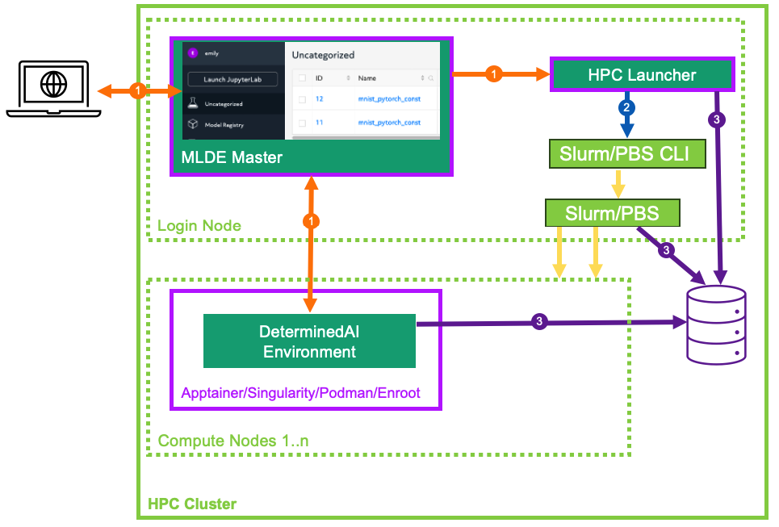

.. _hpc_launching_architecture:

############################
 HPC Launching Architecture
############################

When configured to perform training on an HPC cluster (cluster configuration
:ref:`resource_manager.type: slurm/pbs <cluster-configuration-slurm>`), Determined delegates all job
scheduling and prioritization to the HPC workload manager (either Slurm or PBS) and does not utilize
any Determined agents. Instead, Determined interfaces with the workload managers through the
Determined HPC launcher component.

**************
 HPC Launcher
**************

The launcher is a passive server component that translates and forwards Determined master requests
|co1| to an HPC cluster with a Slurm or PBS workload manager. While it is generally co-located with
the Determined master and hosted on an HPC cluster login or admin node, that is not a hard
requirement. The launcher interacts with the HPC cluster solely via the Slurm/PBS command line
interface |co2| and by generated batch scripts |co3| and jobs logs on the shared file system.
Therefore, it can be hosted on any system that meets these requirements.

HPC Launcher Feature Summary
============================

-  Secure, private internal REST interface for use by Determined master.

   -  High-level abstraction to enable Determined to manage Slurm/PBS jobs.

   -  Generates the batch script and ancillary files to enable job submission (``sbatch``,
      ``qsub``).

   -  User impersonation via a setuid program to enable the configured Determined user agent to
      submit jobs to the cluster. Existing OS and workload manager permissions and resource
      enforcement are maintained. Launcher need not be configured to run as the root user.

   -  Job submission and launch failure logs.

   -  On-demand job status query (``sinfo``, ``squery``, ``pbsnodes``, ``qstat``).

   -  Job cancellation (``scancel``, ``qdel``).

-  Support for various workload managers (Slurm/PBS) and container runtimes
   (Apptainer/Singularity/Podman/Enroot).

-  Image caching model for Apptainer/Singularity.

-  Minimal state stored solely on the file system.

Job Management Overview
=======================

Temporary files (generated batch files, model Python code, ``startup-hook.sh``, etc.), per-rank
local directories in each container (``/tmp``, ``/run/determined/workdir``, etc.), and job log files
are all stored under the cluster-wide directory specified via ``resource_manager.job_storage_root``.
The lifetime of these files is limited to that of the submitted job, and are removed when job
failure or completion is detected by Determined.

#. Determined submits a job to the launcher.

#. A directory tree is created by the launcher for the job.

#. Files provided by Determined are staged.

#. A batch script is generated to describe the required resource request (see Job Resource
   Scheduling) from the workload manager and context (environment variables, and container launch
   commands).

#. The ownership of the files is transferred to the launching user (``sudo chown``).

#. The batch script is submitted for execution on behalf of the user (``sudo sbatch``, ``sudo
   qsub``). See :ref:`hpc-security-considerations` for the details of how ``sudo`` is configured and
   used with the launcher.

#. Upon being scheduled by the workload manager, the batch script is executed and tasks are launched on the allocated compute nodes.
      #. One Determined environment image is started per node (``srun``, ``pbs_tmrsh``) using the
         specified container runtime (Apptainer, Singularity, Podman, Enroot).

      #. During container initialization, per-rank local directories are configured using soft links
         (``/tmp``, ``/run/determined``), and the container stdout/stderr starts streaming output
         directly to the Determined master.

      #. For distributed training, horovodrun is invoked within the container to distribute work
         within multiple processes across the containers.

#. Once started, the job ID from the workload manager is displayed in the experiment log.

#. Determined polls the launcher for job status waiting for completion.

#. Determined sends a request to the launcher to clean up the job. File ownership is transferred
   back to the launcher (``sudo chown``) which then deletes all temporary files and logs associated
   with the job.

*************************
 Job Resource Scheduling
*************************

As mentioned previously, when using the HPC launcher, Determined delegates all job scheduling and
prioritization to the HPC workload manager (Slurm/PBS). Resource requests are generated into the
submitted batch file derived from the following configuration attributes described in the following
sections.

Cluster Configuration
=====================

The :ref:`resource_manager <cluster-configuration-slurm>` section of the cluster configuration
contributes the following resource scheduling configuration. See the :ref:`slurm/pbs section
<cluster-configuration-slurm>` of the cluster configuration reference for the full list of
configuration options.

-  ``slot_type``: The default slot type (``cuda``, ``rocm``, ``cpu``) when users request resources
   from Determined in terms of ``slots_per_trial``. May be overridden per partition/resource pool.

-  ``tres_supported``: Indicates if ``SelectType=select/cons_tres`` is set in the Slurm
   configuration.

-  ``gres_supported``:

   -  For Slurm, it indicates that ``GresTypes=gpu`` is set in the Slurm configuration, and nodes
      with GPUs have properly configured GRES indicating the presence of any GPUs. T
   -  For PBS, the ngpus resource can be used to identify the number of GPUs available on a node.

-  ``default_aux_resource_pool``: The default resource pool to use for tasks that do not need
   dedicated compute resources, auxiliary, or systems tasks. Defaults to the Slurm/PBS default
   partition if no resource pool is specified.

-  ``default_compute_resource_pool``: The default resource pool to use for tasks that require
   compute resources, e.g. GPUs or dedicated CPUs. Defaults to the Slurm/PBS default partition if it
   has GPU resources and if no resource pool is specified.

-  ``job_project_source``: Identifies the source to be used when generating a Slurm Workload
   Characterization Key (WCKey), or PBS project name.

Experiment Configuration
========================

The experiment contributes the following resource scheduling configuration. See the
:ref:`experiment-config-reference` for the full details for these configuration options.

-  ``resource_pool``: Identifies the queue/partition to be used.

-  ``slots_per_trial``: The number of slots to use for each trial of this experiment.

-  ``slurm``:

   -  ``sbatch_args``: Array of Slurm options added as ``#SBATCH`` options in the generated batch
      script.
   -  ``slots_per_node``: The minimum number of slots required for a node to be scheduled during a
      trial.
   -  ``gpu_type``: The Slurm gres type of the GPU to be injected into any generated
      ``--gpus``/``–gres`` expressions. By default, no type is specified.

-  ``pbs``:

   -  ``pbsbatch_args``: Array of PBS options added as ``#PBS`` options in the generated batch
      script.
   -  ``slots_per_node``: The minimum number of slots required for a node to be scheduled during a
      trial.

Slurm Scheduling
================

All information is passed to Slurm through options in the generated sbatch file. You may identify
the location of the generated sbatch file and logs using the Slurm command scontrol show job, and
then inspect the content any time prior to job completion. These temporary files are removed upon
job termination. On job startup failures a portion of the error log is added to the experiment log
to assist in diagnosing the problem.

Common Slurm Options
--------------------

The following options are generated by Determined and cannot be directly specified by the user.
Additional options specified by ``slurm.sbatch_args`` will be added to the generated batch file
provided that they do not conflict with Determined-controlled settings.

+------------------------+-------------------------------------------------------------------------------------------+
| Option                 | Description                                                                               |
+========================+===========================================================================================+
| ``--error``            | Captures error/output logs. On job startup failure, a portion of the error log is added   |
|                        | to the experiment log to assist in diagnosing the problem. During normal operation, logs  |
| ``--output``           | are piped directly to the Determined master and these files are not used.                 |
+------------------------+-------------------------------------------------------------------------------------------+
| ``--job-name``         | Generated job name of the form ``det-ai_`` followed by the Determined job type (``exp``,  |
|                        | ``cmd``, ``gc``) then an internal HPC launcher unique job id.                             |
+------------------------+-------------------------------------------------------------------------------------------+
| ``--partition``        | Partition name as determined by the selected resource pool.                               |
+------------------------+-------------------------------------------------------------------------------------------+
| ``--wckey``            | A value identified by the ``resource_manager.job_project_source`` configuration.          |
+------------------------+-------------------------------------------------------------------------------------------+
| ``--no-requeue``       | Disable any potential automatic requeue of the job by SLURM. Determined will handle the   |
|                        | checkpoint and restart for its experiments.                                               |
+------------------------+-------------------------------------------------------------------------------------------+

Slurm Resource Calculations
---------------------------

Resource requirements for Slurm jobs submitted by Determined are generated according to the table
below. You can specify a ``--gres`` expression via ``slurm.sbatch_args`` as long as it does not
reference a GPU resource. All other ``--gres`` options from the ``slurm.sbatch_args`` will be
generated into the generated batch script.

.. table::
   :width: 1000px
   :widths: 5 5 5 35 40

   +-----------+----------------+----------------+----------------------------------------------------+----------------------------------------------------------------------------+
   | Slot      | Tres [#tres]_  | Gres [#gres]_  | Resulting Slurm Options                            |  Description                                                               |
   | Type      |                |                |                                                    |                                                                            |
   +===========+================+================+====================================================+============================================================================+
   | ``cuda``  | ``true``       |  ``true``      | ``--gpus=`` [*gpu_type*:] *slots_per_trial*        | Slurm determines the number of nodes necessary to                          |
   |           |                |                |                                                    | allocate the requested GPUs. One container is started                      |
   | ``rocm``  |                |                | ``--nodes=`` 1 - *slots_per_trial*                 | per node. Multiple GPUs will be allocated per node                         |
   |           |                |                |                                                    | when available. If ``slots_per_node`` is specified, it is                  |
   |           |                |                | ``--tasks-per-node=`` 1                            | added as ``--gpus_per_task`` to ensure each node                           |
   |           |                |                |                                                    | has at least the specified number of GPUs.                                 |
   |           |                |                | ``--gpus-per-task=`` [*gpu_type*:] *slots_per_node*|                                                                            |
   |           |                |                |                                                    |                                                                            |
   +-----------+----------------+----------------+----------------------------------------------------+----------------------------------------------------------------------------+
   | ``cuda``  |  ``false``     |   ``true``     | ``--nodes=`` *slots_per_trial*/*slots_per_node*    | Allocates the                                                              |
   |           |                |                |                                                    | calculated ``slots_per_trial`` / ``slots_per_node`` nodes,                 |
   | ``rocm``  |                |                | ``--ntasks=`` *slots_per_trial*/*slots_per_node*   | and ``slots_per_node`` GPUs per node and starts one                        |
   |           |                |                |                                                    | container per node.                                                        |
   |           |                |                | ``--gres=gpu`` [:*gpu_type*]:*slots_per_node*      |                                                                            |
   +-----------+----------------+----------------+----------------------------------------------------+----------------------------------------------------------------------------+
   |  ``cpu``  |    *n/a*       |  *n/a*         | ``--nodes=`` *slots_per_trial*/*slots_per_node*    | Allocates the calculated                                                   |
   |           |                |                |                                                    | ``slots_per_trial`` / ``slots_per_node`` nodes,                            |
   |           |                |                | ``--ntasks=`` *slots_per_trial*/*slots_per_node*   | and ``slots_per_node`` CPUs per node and starts one                        |
   |           |                |                |                                                    | container per node. If specified, ``slots_per_node`` is                    |
   |           |                |                | ``--cpus-per-task=`` *slots_per_node*              | add as ``--cpus_per_task`` to ensure we get nodes                          |
   |           |                |                |                                                    | with the desired number of CPUs per node.                                  |
   |           |                |                |                                                    |                                                                            |
   +-----------+----------------+----------------+----------------------------------------------------+----------------------------------------------------------------------------+
   | ``cuda``  |   ``false``    | ``false``      | ``--nodes=`` *slots_per_trial*/*slots_per_node*    | Allocates the calculated                                                   |
   |           |                |                |                                                    | ``slots_per_trial`` / ``slots_per_node`` nodes,                            |
   | ``rocm``  |                |                | ``--ntasks=`` *slots_per_trial*/*slots_per_node*   | and ``slots_per_node`` GPUs per node and starts one                        |
   |           |                |                |                                                    | container per node. It is the user’s responsibility to                     |
   |           |                |                |                                                    | ensure that ``slots_per_node`` GPUs will be available on                   |
   |           |                |                |                                                    | the nodes selected for the job using other                                 |
   |           |                |                |                                                    | configurations such as targeting a specific resource                       |
   |           |                |                |                                                    | pool with only ``slots_per_node`` GPU nodes or                             |
   |           |                |                |                                                    | specifying a Slurm constraint in the experiment                            |
   |           |                |                |                                                    | configuration.                                                             |
   |           |                |                |                                                    |                                                                            |
   +-----------+----------------+----------------+----------------------------------------------------+----------------------------------------------------------------------------+

.. [#tres]

   The ``tres_supported`` option of the cluster configuration :ref:`resource_manager.type: slurm
   <cluster-configuration-slurm>`.

.. [#gres]

   The ``gres_supported`` option of the cluster configuration :ref:`resource_manager.type: slurm
   <cluster-configuration-slurm>`.

Slurm Task Distribution
-----------------------

Distribution of tasks among the nodes allocated by Slurm is accomplished using the Slurm ``srun``
command within the generated sbatch file (no special options are required). Environment variables
from the experiment configuration and all variables needed by Determined are exported from the
generated sbatch file. For those container platforms that do not inherit environment variables by
default, each variable is explicitly passed to the container via command line arguments.

PBS Scheduling
==============

All information is passed to PBS through options in the generated PBS batch file. You may identify
the location of the generated PBS batch file and logs using the command ``qstat -f``, and then
inspect the content any time prior to job completion. These temporary files are removed upon job
termination. On job startup failure, a portion of the error log is added to the experiment log to
assist in diagnosing the problem.

Common PBS Options
------------------

The following options are generated by Determined and cannot be directly specified by the user.
Additional options specified by ``pbs.pbsbatch_args`` will be added to the generated batch file
provided that they do not conflict with Determined-controlled settings.

+------------------------+-------------------------------------------------------------------------------------------+
| Option                 | Description                                                                               |
+========================+===========================================================================================+
| ``-N``                 | Generated job name of the form ``det-ai_`` followed by the Determined job type            |
|                        | (``exp_#_trial``, ``cmd``, or ``gc``) then an internal HPC launcher unique job            |
|                        | identifier. Example: ``det-ai_exp-2-trial-2-f53889084a0b4510-b19cc33ba8a50203``           |
+------------------------+-------------------------------------------------------------------------------------------+
| ``-q``                 | Queue name as determined by the selected resource pool.                                   |
+------------------------+-------------------------------------------------------------------------------------------+
| ``-e`` ``-o``          | Captures error/output logs. On job startup failures a portion of the error log is added   |
|                        | to the experiment log to assist in diagnosing the problem. During normal operation, logs  |
|                        | are piped directly to the Determined master and these files are not used.                 |
+------------------------+-------------------------------------------------------------------------------------------+
| ``--V``                | Inherit environment variables.                                                            |
+------------------------+-------------------------------------------------------------------------------------------+
| ``-r n``               | No automatic restart of the job. Allow Determined to handle restarts.                     |
+------------------------+-------------------------------------------------------------------------------------------+
| ``-W umask=0022``      | Allows the HPC launcher to read the error/output logs.                                    |
+------------------------+-------------------------------------------------------------------------------------------+
| ``-P``                 | A value identified by the ``resource_manager.job_project_source`` configuration.          |
+------------------------+-------------------------------------------------------------------------------------------+

PBS Resource Calculations
-------------------------

Resource requirements for PBS jobs submitted by Determined are generated according to the table
below. You can specify a ``-l select`` expression via ``pbs.pbsbatch_args``, however chunk count,
chunk arrangement, and GPU or CPU counts per chunk (depending on the value of ``slot_type``) are
controlled by Determined; any values specified for these quantities will be ignored. All other
resource requests from the ``pbs.pbsbatch_args`` will be appended to the select expression generated
into the generated batch script.

.. table::
   :widths: 5 5 50 30

   +----------------------------+----------------+----------------------------------------------------+----------------------------------------------------------------------------+
   | Slot                       | Gres [#pgres]_ | Resulting PBS Options                              |  Description                                                               |
   | Type                       |                |                                                    |                                                                            |
   +============================+================+====================================================+============================================================================+
   | ``cuda``                   |  ``true``      | ``#PBS -l select=``                                | The calculated ``slots_per_trial``/``slots_per_node`` GPUs are allocated,  |
   |                            |                |  *slots_per_trial* / *slots_per_node*              | One container is started per node (manually implemented via the generated  |
   | ``rocm``                   |                |                                                    | PBS batch script). Multiple nodes are used when needed.                    |
   |                            |                |  ``:ngpus=`` *slots_per_node*                      | If ``slots_per_node`` is not specified, 1 is used in the calculation.      |
   |                            |                |                                                    |                                                                            |
   +----------------------------+----------------+----------------------------------------------------+----------------------------------------------------------------------------+
   | ``cuda``                   |  ``false``     | ``#PBS -l select=``                                | The calculated ``slots_per_trial``/``slots_per_node`` GPUs are allocated.  |
   |                            |                |   *slots_per_trial* / *slots_per_node*             | It is the user’s responsibility to ensure that``slots_per_node`` GPUs      |
   | ``rocm``                   |                |                                                    | will be available on nodes selected for the job using other configurations |
   |                            |                |                                                    | such as targeting a specific resource pool with only                       |
   |                            |                |                                                    | ``slots_per_node`` GPU nodes, or specifying a PBS                          |
   |                            |                |                                                    | PBS resource request in the experiment configuration.                      |
   |                            |                |                                                    |                                                                            |
   |                            |                |                                                    | It is up to the user to set the ``CUDA_VISIBLE_DEVICES`` environment       |
   |                            |                |                                                    | variable in their experiment.                                              |
   +----------------------------+----------------+----------------------------------------------------+----------------------------------------------------------------------------+
   | ``cpu``                    |  *n/a*         | ``#PBS -l select=``                                | Allocates the calculated ``slots_per_trial``/``slots_per_node`` nodes,     |
   |                            |                |  *slots_per_trial* /  *slots_per_node*             | and ``slots_per_node`` CPUs per node.                                      |
   |                            |                |                                                    | If ``slots_per_node`` is not specified, 1 is used in the calculation.      |
   |                            |                |  ``:ncpus=`` *slots_per_node*                      |                                                                            |
   +----------------------------+----------------+----------------------------------------------------+----------------------------------------------------------------------------+

.. [#pgres]

   The ``gres_supported`` option of the cluster configuration :ref:`resource_manager.type: pbs
   <cluster-configuration-slurm>`.

PBS Task Distribution
---------------------

The distribution of tasks among the nodes allocated by PBS is accomplished by custom support in the
generated batch file. For each unique host in the ``$PBS_NODEFILE``, an asynchronous ``pbs_tmrsh``
command invocation is generated to launch the task on the node to launch the specified container and
arguments. The batch script waits for the completion of those processes before exiting. A non-zero
status return from any of those invocations causes the entire job to be terminated.

Environment variables from the experiment configuration and all variables needed by Determined are
explicitly passed to the container as arguments as there is no environment variable inheritance from
the PBS batch script to the containers on the nodes.
