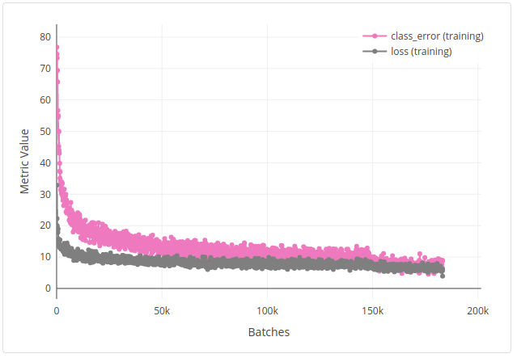
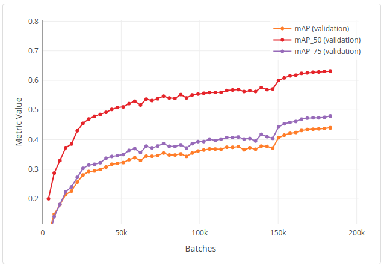

# Deformable DETR: Deformable Transformers for End-to-end Object Detection  (Zhu et al. 2021)
This example implements the Deformable DETR (DDETR) model introduced by Zhu et al. (2021) in their [recent paper] accepted at ICLR 2021 (https://openreview.net/forum?id=gZ9hCDWe6ke).
DDETR drastically improves the convergence speed of DETR with multi-scale features and sparse spatial sampling with deformable attention.  

This implementation largely uses the original implementation provided in [this repo](https://github.com/fundamentalvision/Deformable-DETR).  With this Determined implementation, you can easily run DDETR with distributed training and hyperparameter search by modifying a few flags in the [experiment config](distributed.yaml).  Note that the panoptic segmentation task is not supported in this example.

## Files
This example is structure as follows:
* [model_def.py](model_def.py): initializes the data, optimizer, and model and specifies the training and evaluation steps.
* [model.py](model.py): modifies the original [SetCriterion function](https://github.com/fundamentalvision/Deformable-DETR/blob/main/models/deformable_detr.py#L198) to use horovod allreduce to sync number of bounding boxes.
* [data.py](data.py): creates a CocoDetection dataset to work with Google Cloud Storage. 

### Configuration Files
* [const_fake.yaml](const_fake.yaml): single-GPU experiment to run with fake data.
* [distributed.yaml](distributed.yaml): distributed training experiment to run with COCO dataset on Google Cloud Storage.
* [finetune.yaml](finetune.yaml): finetune pretrained model on a subset of classes in COCO.
* [finetune_adaptive.yaml](finetune_adaptive.yaml): perform HP search for a finetuned model on a subset of classes in COCO.

## Data
This example requires the COCO 2017 Object Detection dataset.  There are different backends that you can select for accessing the data (see [data.py](data.py)): aws, gcs, local, and fake.  
* The aws backend will download iamges from an S3 bucket.  
* The gcs backend will download images from a Google Cloud Storage bucket.
* The local backend will download the COCO dataset directly from source to the harddrive and read images from disk.
* The fake backend will use a fake image without requiring COCO to be available anywhere.  

You can choose a different backend by modifying the `backend` field in the experiment config. 

## To Run
Unless you plan to run with fake data, you'll need to have access to the COCO 2017 dataset in either cloud storage or the local disk (see https://cocodataset.org/#home for download instructions). 
Once you have the dataset set up, modify the experiment config you want to run with the desired `backend` and fill in the `data_dir` field with the bucket name if using gcs or aws backend, or data directory if using the local backend.

Then, submit the experiment to your Determined cluster by running
```
det experiment create <distributed.yaml> .
```
from the command line.

## Results
The training and validation curves when running the `distributed.yaml` config are shown below.  They closely match the reported result of 43.8 after 50 epochs on COCO from the paper (see Table 1) using [the base configuration in the original repo](https://github.com/fundamentalvision/Deformable-DETR/blob/main/configs/r50_deformable_detr.sh).



