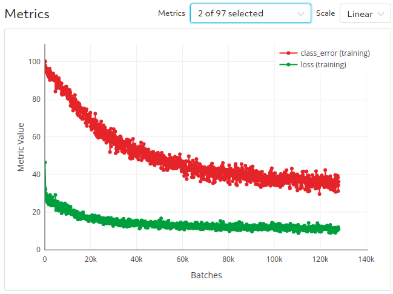

# End-to-end Object Detection with Transformers (Carion et al. 2020)
This example implements the Detection Transformers (DETR) model introduced by Carion et al. (2020) in their [recent paper](https://arxiv.org/abs/2005.12872).  
DETR drastically simplifies the object detection pipeline by doing away with complex postprocessing steps required by most other architectures to extract bounding boxes.  
In place of proposals, anchors, and window centers, DETR directly optimizes a set prediction loss to learn where to focus.  

This implementation largely uses the original implementation provided in [this repo](https://github.com/facebookresearch/detr).  With this Determined implementation, you can easily run DETR with distributed training and hyperparameter search by modifying a few flags in the [experiment config](distributed.yaml).

## Files
This example is structure as follows:
* [model_def.py](model_def.py): initializes the data, optimizer, and model and specifies the training and evaluation steps.
* [model.py](model.py): modifies the original [SetCriterion function](https://github.com/facebookresearch/detr/blob/master/models/detr.py#L83) to use horovod allreduce to sync number of bounding boxes.
* [data.py](data.py): creates a CocoDetection dataset to work with Google Cloud Storage. 
* [distributed.yaml](distributed.yaml): distributed training experiment to run with COCO dataset on Google Cloud Storage.
* [const_fake.yaml](const_fake.yaml): single-GPU experiment to run with fake data.


## Running the example
If you have the COCO 2017 dataset available in a Google Cloud Storage bucket, you can modify the `bucket_name` field in [distributed.yaml](distributed.yaml) to point to your location.  Otherwise, you can run this example with fake data using the [const_fake.yaml](const_fake.yaml) config.  Submit the experiment to your Determined cluster by running
```
det experiment create <distributed.yaml> .
```
from the command line.

## Results
The training and validation curves generated by this experiment are shown below.  They closely match the [results for the 150 epoch learning rate schedule provided in the original repo](https://gist.github.com/szagoruyko/b4c3b2c3627294fc369b899987385a3f).




   

