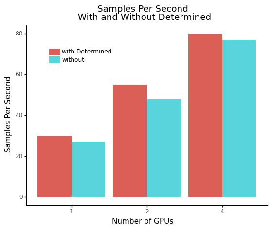
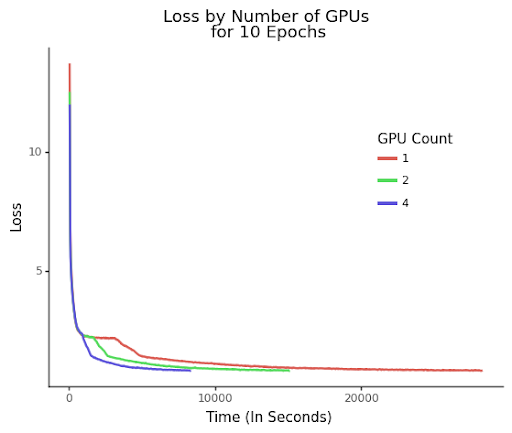

# EfficientDet Example

This example is an EfficientDet port using Determined's PyTorchTrial API. The original example can be found on
 [rwightman's EfficientDet Github](https://github.com/rwightman/efficientdet-pytorch/tree/678bae1597eb083e05b033ee3eb585877282279a).

## Files
* **model_def.py**: The core code for the model. This includes building and compiling the model.
* **startup-hook.sh**: This script will automatically be run by Determined during startup of every container launched for this experiment. This script installs some additional dependencies.
* **efficientdet_files/**: This folder includes original EfficientDet files that have been slightly altered to work with Determined.

### Configuration Files
* **const.yaml**: Train the model with constant hyperparameter values.
* **distributed.yaml**: Same as `const.yaml`, but trains the model with multiple GPUs (distributed training).
* **adaptive.yaml**: Runs an adaptive search with the configured restraints.

## Data
The coco dataset is the primary dataset for this port. Information on how to download the dataset can be found [here](https://github.com/rwightman/efficientdet-pytorch/tree/678bae1597eb083e05b033ee3eb585877282279a#coco). Once downloaded, copy the data on all the Determined agents. Then configure the bind mount in the configuration files to the appropriate location. More information on bind mounts can be found [here](https://docs.determined.ai/latest/tutorials/data-access.html#distributed-file-system).

## To Run
If you have not yet installed Determined, installation instructions can be found
under `docs/install-admin.html` or at https://docs.determined.ai/latest/index.html

Run the following command: `det -m <master host:port> experiment create -f 
const.yaml .`. The other configurations can be run by specifying the appropriate 
configuration file in place of `const.yaml`.

## Results
The default configurations are based on [rwightman's reported results](https://github.com/rwightman/efficientdet-pytorch/tree/678bae1597eb083e05b033ee3eb585877282279a#efficientdet-d0). After 5 training days, the model `efficientdet_d0`'s mAP should be about .326. To help optimize `sync_batch_norm`, set `tensor_fusion_threshold: 1` and `tensor_fusion_cycle_time: 2` to improve training performance time.

Note: The purpose of these graphs is to show the `efficientdet_d0` model running in Determined 
for a set number of epochs, demonstrating the acceleration of model training time 
achieved with Determined’s distributed training. The plots are based on 4x2080tis

