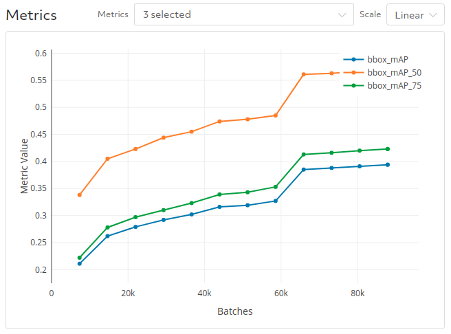

# MMDetection in Determined
This example allows you to use the powerful object detection library [MMDetection](https://github.com/open-mmlab/mmdetection) while benefiting from all the features available on Determined's integrated deep learning platform.  In particular, get access to automated resource provisioning and experiment tracking with Determined along with state-of-the-art support for distributed training and hyperparameter tuning with little to no code modification.  

## Capabilities
Most of the configurations provided in the original [`mmdetection` repo](https://github.com/open-mmlab/mmdetection/tree/master/configs) are supported here.  You can see examples of how to submit an experiment to a Determined cluster with a particular config in [`maskrcnn.yaml`](maskrcnn.yaml).  The provided experiment configurations are as follows:
* Mask R-CNN: [`maskrcnn.yaml`](mask_rcnn.yaml)
* RetinaNet: [`retinanet.yaml`](retinanet.yaml)
* Generalized Focal Loss: [`gfl.yaml`](gfl.yaml)

## Files
The function of the files and directories within this example are as follows:
* [`model_def.py`](model_def.py): Entrypoint for Determined following our [PyTorch trial API](https://docs.determined.ai/latest/reference/api/pytorch.html).
* [`startup-hook.sh`](startup-hook.sh): Startup script run before start of experiment to make sure the annotation files are downloaded.
* [`configs/`](configs): Predefined configs from mmdetection.
* [`docker/`](docker): Dockerfile used to create the container for this example.
* [`utils/`](utils): Utility functions to port over mmdetection capabilities for compatibility with Determined.

## Results
We evaluated the performance of the library in Determined relative to the original mmdetection library both in terms of speed and predictive accuracy.  The comparisons were conducted on `n1-standard-64` instances with 8 NVidia Tesla V100 GPUs.
You can get the docker image we used by running
```
docker pull liamdetermined/development:mmdetection
``` 
which uses PyTorch 1.4 with CUDA 10.0.  

### Speed Comparison
We ran the following command within the docker container from the `mmdetection` folder:
```
./toos/dist_train.sh configs/mask_rcnn_r50_caffe_fpn_poly_1x_coco.py 8
```
both with and without tensorboard logging.  We enabled tensorboard by uncommenting [this line](https://github.com/open-mmlab/mmdetection/blob/master/configs/_base_/default_runtime.py#L7).  
The logs with run times of the first 700 iterations are available in the [`benchmarks_results`](./benchmark_results) folder.

Next, we ran the same config in Determined by submitting the following experiment to a similarly configured cluster:
```
det experiment create maskrcnn.yaml .
```

Determined has tensorboard enabled by default so we compare the tensorboard times accordingly:
|                    | In Determined | Original Repo |
|--------------------|---------------|---------------|
| Secs per iteration | 0.310         | 0.305         |


### Model Quality
We trained the [`gfl.yaml`](gfl.yaml) model to convergence and reached a mAP of 39.4. With Determined, you can monitor the performance of your experiments in real time with our WebUI.

**Training Metrics**


**Validation Metrics**




## Try it out!
You will need to have access to the COCO 2017 data either via disk or through Google Cloud Storage and set the `backend` field of the `data` config to either `disk` or `gcp` accordingly.

