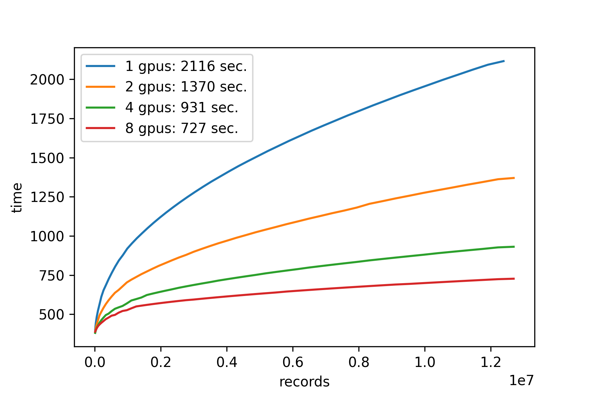

# PyTorch ShiftViT Example

This example demonstrates how to implement the [ShiftVit model](https://arxiv.org/abs/2201.10801) using Determined AI's
PyTorch API. Model code is imported from the ShiftViT authors' [github implementation](https://github.com/microsoft/SPACH).

## Files

### Python

* `model_def.py`: core code containing the Determined AI `PyTorchTrial` subclass.
* `data.py`: handles the
[MNIST](http://pytorch.org/vision/main/generated/torchvision.datasets.MNIST.html#torchvision.datasets.MNIST),
[CIFAR10](http://pytorch.org/vision/main/generated/torchvision.datasets.CIFAR10.html),
and [ImageNet](https://www.image-net.org) datasets.
* `generate_blob_list.py`: scripts to pre-process GCS blobs (increases ImageNet speed)

### Bash
* `startup-hook.sh`: startup script run by Determined within every launched container. Installs additional dependencies
and clones the ShiftViT repo.

### YAML
Configuration files:
* `const_mnist.yaml`: Train on MNIST using a single slot and fixed hyperparameters.
* `distributed_mnist.yaml`: Train on MNIST using a multiple slots and fixed hyperparameters.
* `adaptive_mnist.yaml`: MNIST hyperparameter search using ASHA.
* `const_cifar10.yaml`: Train on CIFAR10 using a single slot and fixed hyperparameters.
* `distributed_cifar10.yaml`: Train on CIFAR10 using a multiple slots and fixed hyperparameters.
* `adaptive_cifar10.yaml`: CIFAR10 hyperparameter search using ASHA.
* `distributed_imagenet.yaml`: Train on ImageNet using a multiple slots and fixed hyperparameters,
following the ShiftViT training defaults.

## Data
The MNIST and CIFAR10 datasets are downloaded via
[`torchvision` `Dataset` objects](https://pytorch.org/vision/stable/datasets.html).
ImageNet is expected to have been downloaded by the user and placed in a GCS bucket, along with the
outputs of `generate_blob_list.py`.

## To Run
If you have not yet installed Determined, installation instructions can be found
under `docs/install-admin.html` or [here](https://docs.determined.ai/latest/index.html).

A constant MNIST trial can be run via `det -m <master host:port> experiment create -f
const_mnist.yaml .`. The other configurations can be run by specifying the appropriate
configuration file in place of `const_mnist.yaml`.

## Results

### MNIST and CIFAR10

MNIST and CIFAR10 trial data using GCP clusters with four T4 GPUs per node and the above `yaml`
configs:

| Config File                | Accuracy (%) |
|----------------------------|--------------|
| `const_mnist.yaml`         | 99.2         |
| `distributed_mnist.yaml`   | 99.1         |
| `const_cifar10.yaml`       | 81.7         |
| `distributed_cifar10.yaml` | 84.4         |

### ImageNet Timing

The graphic below demonstrates the timing results for training the ShiftVit model on ImageNet data
using 1, 2, 4, and 8 GPUs.  Each model was trained on a fixed number of records and the speed-up
due to distributed training is evident. The durations are measured relative to the beginning of
of each experiment.
