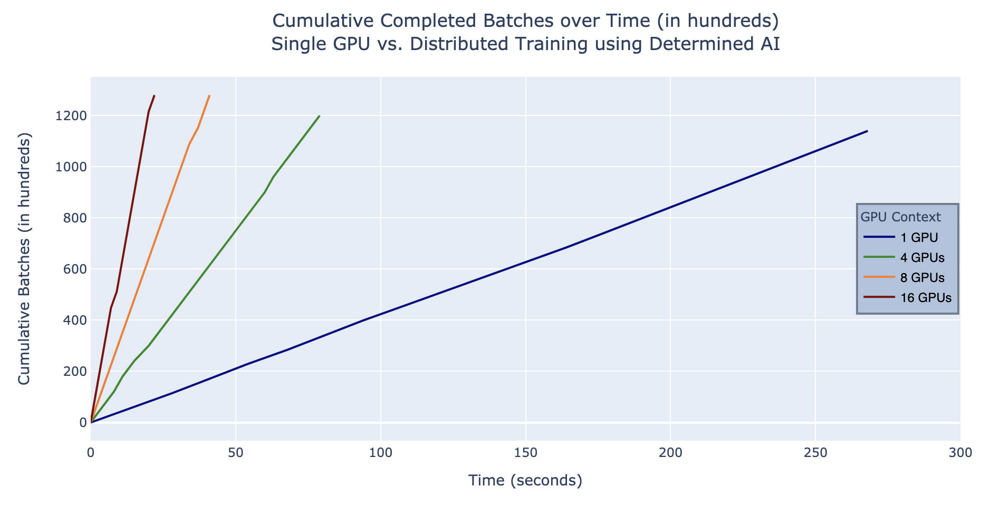

# TensorFlow (tf.keras) UNet Example

This example shows how to build an unets image segmentation model on the 
Oxford-IIIT Pet dataset using Determined's tf.keras API. This example is adapted 
from this [Tensorflow Image Segmentation example](https://www.tensorflow.org/tutorials/images/segmentation).

## Files
* **model_def.py**: The core code for the model. This includes building and compiling the model.
* **startup-hook.sh**: This script will automatically be run by Determined during startup of every container launched for this experiment. This script installs some additional dependencies and downloads the training data.

### Configuration Files
* **const.yaml**: Train the model with constant hyperparameter values.
* **distributed.yaml**: Same as `const.yaml`, but trains the model with multiple GPUs (distributed training).

## Data
The data used for this script was fetched via Tensorflow Datasets as done by the tutorial itself. 
The original Oxford-IIIT Pet dataset is linked [here](https://www.robots.ox.ac.uk/~vgg/data/pets/). 

## To Run
If you have not yet installed Determined, installation instructions can be found
under `docs/install-admin.html` or at https://docs.determined.ai/latest/index.html

Run the following command: `det -m <master host:port> experiment create -f 
const.yaml .`. The other configurations can be run by specifying the appropriate 
configuration file in place of `const.yaml`.

## Results
Note: The purpose of these graphs is to show a Unets model running in Determined 
for a set number of epochs, demonstrating the acceleration of model training time 
achieved with Determined’s distributed training.

