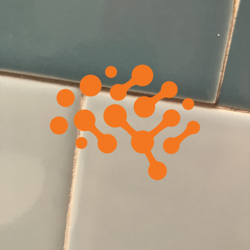
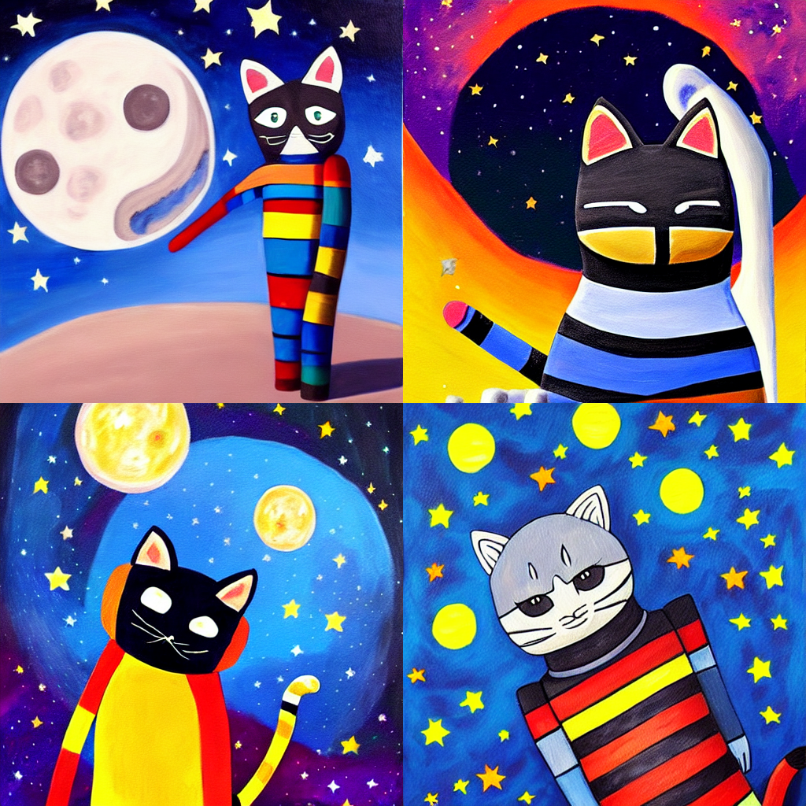
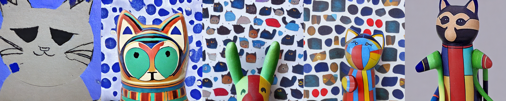

# Textual Inversion with Stable Diffusion

This example demonstrates how to incorporate your own images into AI-generated art via
[Textual Inversion](https://textual-inversion.github.io).

The development of [Latent Diffusive Models](https://arxiv.org/abs/2112.10752) has made
it possible to run (and fine-tune) diffusion-based models on consumer-grade GPUs. Such tasks are
made even easier by the release
of [Stable Diffusion](https://stability.ai/blog/stable-diffusion-announcement) and the
development of the 🤗 [Huggingface Diffusers](https://huggingface.co/docs/diffusers/index) library.

The present code uses Determined's Core API to seamlessly incorporate 🧨 Diffusers
(and the 🚀 [Accelerate launcher](https://huggingface.co/docs/transformers/accelerate)) into the
Determined framework with minimal code changes.

## Walkthrough: Basic Usage

Below we walk through the Textual Inversion workflow, training on a few images of a specific toy cat
and then incorporating the object into our Stable-Diffusion-generated art.

### Training

The use of Stable Diffusion requires
a [Huggingface User Access Token](https://huggingface.co/docs/hub/security-tokens).
After including your user access token in the `const.yaml` config file and modifying the final part
of the lines which read

```yaml
environment:
  environment_variables:
    - HF_AUTH_TOKEN=YOUR_HF_AUTH_TOKEN_HERE
```

a ready-to-go fine-tuning experiment can be run by executing the following in the present directory:

```bash
det -m MASTER_URL_WITH_PORT e create const.yaml .
```

with the appropriate urlfor your Determined cluster substituted in
for `MASTER_URL_WITH_PORT`. Using four
V100s, the Experiment should take about ~10 minutes to complete.
(The `slots_per_trial` field will need to be reduced, and other hyperparmaeters modified, if you
have fewer than four GPUs on your cluster.)

This will submit an experiment which introduces a new embedding vector into the world of Stable
Diffusion which we will train to correspond to the concept of the Determined AI logo, as represented through
training images found in `/det_logos`, such as the example found below



A corresponding token, chosen to be `<cat-toy>` as specified in the `placeholder_tokens` field
in the config, will then be available for use in our prompts to signify the concept of this cat.

### Inference

Once training has completed, interactive inference can be run by using the included
`textual_inversion.ipynb` on the same Master which performed the Experiment. First, find the uuid
of the final Determined checkpoint for the experiment and set the `CHECKPOINT_UUID` variable in the
notebook accordingly (along with the `HF_AUTH_TOKEN` user access token variable, again).

Running the notebook and fiddling with the various parameters therein, one can generate images such
as the following, which correspond to the
prompt `a painting of <cat-toy> on the moon, stars, outer space, trending on artstation, incredible composition`


By default, the script also writes periodically generated images to checkpoint directory which can
also be viewed in the notebook. These serve as useful visual checks on the training process.

Here is an example of the model's progression (left-to-right) when generating based on the
prompt `a photo of a <cat-toy>`:

Initially, the `<cat-toy>` embedding was chosen to coincide with the embedding of the token `cat`
(as specified in the `initialization_tokens` config field) and the above visualizes the evolution of
this embedding away from the concept of `cat` and towards our concept of `<cat-toy>`.

### Customization

The basic `const.yaml` config can be easily customized to accommodate your own concepts.

The relevant parts of the `hyperparameters` section read:

```yaml
hyperparameters:
  #...
  data:
    learnable_properties: # One of 'object' or 'style' 
      - object
    placeholder_tokens: # Special tokens representing new concepts. Must not exist in tokenizer.  
      - <cat-toy>
    initializer_tokens: # Individual words closely related to added concepts. Must get mapped to single token by tokenizer. 
      - cat
    train_img_dirs: # Directories holding training images.
      - cat_imgs
  #...
  inference:
    inference_prompts:
      - a photo of a <cat-toy>
```

To train on a new concept:

1) Add your training images in a new directory and list it under `train_img_dirs`.
2) Set `learnable_properties` to `object` or `style`, according to which facet of the images you
   wish
   to capture.
3) Choose an entry for `placeholder_tokens`, which is the stand-in for your object in prompts,
   replacing `<cat-toy>` above.
4) Choose a word in `initializer_tokens` which is closely related to your images.
5) All prompts included in `inference_prompts` will be periodically generated by the model and saved
   to the checkpoint directory.

The script also allows you to train on multiple concepts at once. When doing so, simply add the
relevant entries under the
`train_img_dirs`, `learnable_properties`, `placeholder_tokens`, and `initializer_tokens` fields,
keeping the same relative ordering across each.

More advanced customizations can be made by modifying the `const_advanced.yaml` config file.

## The Code

The code for this example is heavily based on
Huggingface's [own implementation](https://github.com/huggingface/diffusers/tree/main/examples/textual_inversion)
of Textual Inversion, refactored into a trainer class for cleaner compartmentalization.

# TODO

A very incomplete list:

* The above cat example can be much improved. Quick and dirty example currently.
* The current `entrypoint`
  is `python -m determined.launch.torch_distributed accelerate launch main.py` which uses
  the [Accelerate launcher](https://huggingface.co/docs/transformers/accelerate) launcher on top of
  our own `torch_distributed` launcher. This is probably a hack? Maybe write our own `accelerate`
  launcher?
* Should also support distributed inference for faster generation.
* Still struggling with getting a great image using the DAI logo.
* fp16 training
* Log images to tensorboard rather than "abuse" the checkpoint directory, in Ryan's words
* Test training at 256 * 256 and image generation at other scales. Separate the `img_size` args for
  training and inference here.
* lr scheduler
* `accelerate --config` support/example