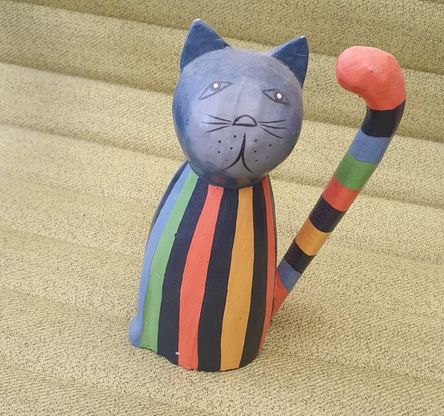

# Textual Inversion with Stable Diffusion

This example demonstrates how to incorporate your own images into AI-generated art.


The development of [Latent Diffusive Models](https://arxiv.org/abs/2112.10752) has made
it possible to run (and fine-tune) diffusion-based models on consumer-grade GPUs.  Such tasks are
made even easier by the release of [Stable Diffusion](https://stability.ai/blog/stable-diffusion-announcement) and the
development of the [Huggingface Diffuser](https://huggingface.co/docs/diffusers/index) library. 

The present code uses Determined's Core API to seamlessly incorporate Diffusers
(and the [Accelerate launcher](https://huggingface.co/docs/transformers/accelerate)) into the
Determined framework with minimal code changes.

## Walkthrough: Basic Usage

### Training

The use of Stable Diffusion requires a [Huggingface User Access Token](https://huggingface.co/docs/hub/security-tokens).
After including your user access token in the `const.yaml` config file, modifying the final part of
the lines which read
```yaml
environment:
    environment_variables:  
        - HF_AUTH_TOKEN=YOUR_HF_AUTH_TOKEN_HERE
```
a ready-to-go fine-tuning experiment can be run by executing the following in the present directory:
```bash
det -m MASTER_URL e create const.yaml .
```
with the appropriate url (with port number) for your Determined cluster substituted in. 
(The `slots_per_trial` field will need to be reduced, and other hyperparmaeters modified, if you have fewer than four GPUs on your cluster.)

This will submit an experiment which fine-tunes Stable Diffusion on images of a toy cat, such
as the one found below:

 


### Inference

Once training has completed, interactive inference can be run by using the included
`textual_inversion.ipynb` on the same Master which performed the Experiment.  First,  find the uuid
of the final Determined checkpoint for the experiment and set the `CHECKPOINT_UUID` variable in the
notebook accordingly (along with the `HF_AUTH_TOKEN` user access token variable, again).

Running the notebook should generate an image such as:


## Textual Inversion

## Implementation


## Basic Use


Requires GPUs (`num_slots >= 1`)

Based on https://github.com/huggingface/notebooks/blob/main/diffusers/sd_textual_inversion_training.ipynb

User needs to provide HF token in config