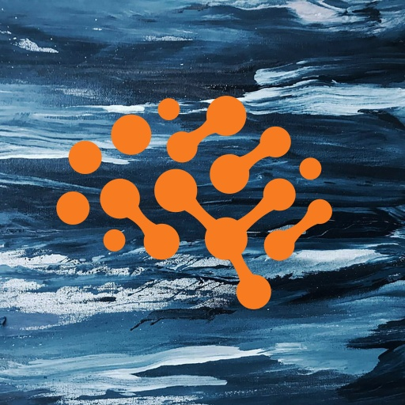

# Textual Inversion with Stable Diffusion

This example demonstrates how to incorporate your own images into AI-generated art via
[Textual Inversion](https://textual-inversion.github.io).

The development of [Latent Diffusive Models](https://arxiv.org/abs/2112.10752) has made
it possible to run (and fine-tune) diffusion-based models on consumer-grade GPUs. Such tasks are
made even easier by the release
of [Stable Diffusion](https://stability.ai/blog/stable-diffusion-announcement) and the
development of the 🤗 [Huggingface 🧨 Diffusers](https://huggingface.co/docs/diffusers/index) library.

The present code uses Determined's Core API to seamlessly incorporate 🧨 Diffusers
(and the 🚀 [Accelerate](https://huggingface.co/docs/transformers/accelerate)) launcher into the
Determined framework.

## Before You Start: 🤗 Account, Access Token, and License

In order to use this repository's implementation of Stable Diffusion, you must:

* Have a [Huggingface account](https://huggingface.co/join).
* Have a [Huggingface User Access Token](https://huggingface.co/docs/hub/security-tokens).
* Accept the Stable Diffusion license (click on _Access
  repository_  [in this link)](https://huggingface.co/CompVis/stable-diffusion-v1-4).

## Walkthrough: Basic Usage

Below we walk through the Textual Inversion workflow, first fine-tuning Stable Diffusion on a set of
user-provided training images featuring a new concept, and then incorporating representations of the
concept into generated art.

### Training

After including your user access token in the `const.yaml` config file by modifying the final part
of the lines which read

```yaml
environment:
  environment_variables:
    - HF_AUTH_TOKEN=YOUR_HF_AUTH_TOKEN_HERE
```

a ready-to-go fine-tuning experiment can be run by executing the following in the present directory:

```bash
det -m MASTER_URL_WITH_PORT e create const.yaml .
```

with the appropriate url for your Determined cluster substituted in
for `MASTER_URL_WITH_PORT`.

This will submit an experiment which introduces a new embedding vector into the world of Stable
Diffusion which we will train to correspond to the concept of the Determined AI logo, as represented
through
training images found in `/det_logos`, such as the example found below (placed on a background for
improved training results):



A corresponding concept token, chosen to be `<det-logo>` as specified in the `concept_tokens` field
in the config, will then be available for use in our prompts to signify the concept of this logo.

By default, sample images are generated during training which can be viewed by launching a
Tensorboard instance from the experiment in the WebUI.

### Notebook Inference

Once training has completed, interactive inference can be run by using the included
`textual_inversion.ipynb` on the same Master which performed the Experiment.

In order to launch the
notebook with the requisite files included in its context, first modify
the `HF_AUTH_TOKEN=YOUR_HF_AUTH_TOKEN_HERE` line in the `detsd-notebook.yaml` config file,
analogously to the above, and then run the following command in the root of
this repo:

```bash
det -m MASTER_URL_WITH_PORT notebook start --config-file detsd-notebook.yaml --context .
```

replacing `MASTER_URL_WITH_PORT` as before. A new notebook window will be launched in which
`textual_inversion.ipynb` can be opened and run.

Your newly trained concepts can be loaded into the notebook by specifying the `uuid`s of their
corresponding Determined checkpoints in the relevant `uuids` list under the _Load Determined
Checkpoints_ section. Then simply run the notebook from top to bottom. Further instructions may be
found in the notebook itself.

#### Typical Results

***To be added!***

## Customization

The basic `const.yaml` config can be easily customized to accommodate your own concepts.

The relevant parts of the `hyperparameters` section read:

```yaml
hyperparameters:
#...
data:
  learnable_properties: # One of 'object' or 'style' 
    - object
  concept_tokens: # Special tokens representing new concepts. Must not exist in tokenizer.  
    - <det-logo>
  initializer_tokens: # Phrases which are closely related to added concepts.
    - orange brain logo, connected circles, concept art
  train_img_dirs:
    - det_logos
#...
inference:
  inference_prompts:
    - a photo of a <det-logo>
```

To train on a new concept:

1) Add your training images in a new directory and list it under `train_img_dirs`.
2) Set `learnable_properties` to `object` or `style`, according to which facet of the images you
   wish
   to capture.
3) Choose an entry for `concept_tokens`, which is the stand-in for your object in prompts,
   replacing `<det-logo>` above.
4) Choose the `initializer_tokens`, which should be a short, descriptive phrase closely related to
   your images.
5) All prompts included in `inference_prompts` will be periodically generated by the model and saved
   to the checkpoint directory.

You can also train on multiple concepts at once. When doing so, simply add the
relevant entries under the
`train_img_dirs`, `learnable_properties`, `concept_tokens`, and `initializer_tokens` fields,
keeping the same relative ordering across each.

More advanced customizations can be made by modifying the `const_advanced.yaml` config file.

## Some Tips

Generating results of the desired quality is often a balancing act:

* Training images are resized to 512 x 512 pixels and can optionally center-cropped (
  see `const_advanced.yaml`). Resizing your training images accordingly will lead to the most
  consistent results.
* The provided config files do not use many SGD steps and are intended for quick demonstration.
  Increase the `max_length` field, and adjust other training hyperparameters, for more finely tuned
  results.
* There is generally a tradeoff between how faithfully the training images are reproduced and how
  well they can be incorporated into the desired scene. Over-training may lead to perfect-likeness,
  while also overwhelming all other elements in your chosen prompt.
* Prompts are very sensitive to word order. Stable Diffusion pays much more attention to words at
  the
  beginning of a prompt than it does to words at the end.
* Longer prompts often result in better results. See
  the [Prompt Development](https://www.reddit.com/r/StableDiffusion/comments/xcq819/dreamers_guide_to_getting_started_w_stable/)
  section of this link for more detailed tips on prompt-engineering.

## The Code

The code for this example based on a mix of
Huggingface's [own implementation](https://github.com/huggingface/diffusers/tree/main/examples/textual_inversion)
of Textual Inversion (refactored into a trainer class for cleaner compartmentalization) and ideas
drawn from the original [Textual Inversion](https://github.com/rinongal/textual_inversion) repo and
from the #community-research channel on the
official [Stable Diffusion Discord Server](https://www.diffusion.gg).

# TODO

A very incomplete list:

* Still tuning the ready-to-go experiment, trying to find a balance between results and speed.
* The current `entrypoint`
  is `python -m determined.launch.torch_distributed accelerate launch main.py` which uses
  the [Accelerate launcher](https://huggingface.co/docs/transformers/accelerate) on top of
  our own `torch_distributed` launcher. This is probably a hack? Maybe write our own `accelerate`
  launcher?
* Should also support distributed inference for faster generation.
* fp16 training
* Test training at 256 * 256 and image generation at other scales. Separate the `img_size` args for
  training and inference here.
* lr scheduler
* `accelerate --config` support/example
* Multi-experiment visualizations currently showing no data for some reason.
* Trial stats are only uploaded upon trial completion due to some change between 0.19.0 and 0.19.2,
  for unclear reasons
* Tensorboard doesn't seem to update when new images are generated. Need to kill TB agent and
  restart it to see new images.
* Images generated towards the end of training are inconsistently uploaded at all to TB.
* Link to blog post, when published.
* Hitting some CUDA OOM errors when resuming training with ADAM or ADAM4 on T4 GPUs.
