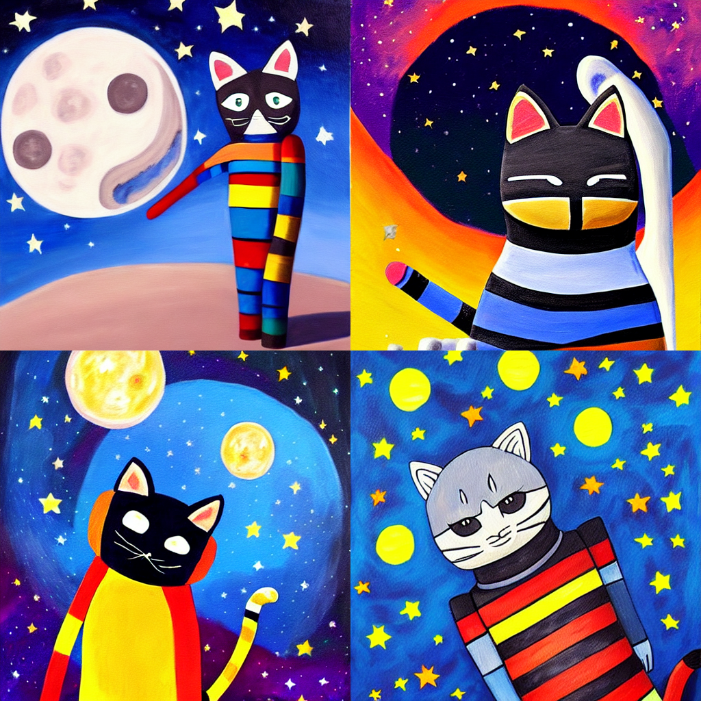
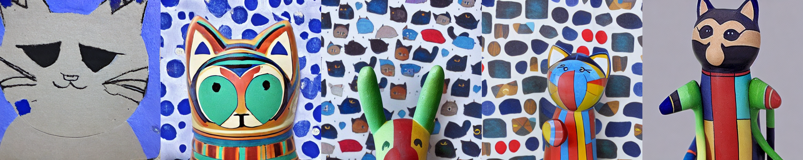

# Textual Inversion with Stable Diffusion

This example demonstrates how to incorporate your own images into AI-generated art via
[Textual Inversion](https://textual-inversion.github.io).

The development of [Latent Diffusive Models](https://arxiv.org/abs/2112.10752) has made
it possible to run (and fine-tune) diffusion-based models on consumer-grade GPUs. Such tasks are
made even easier by the release
of [Stable Diffusion](https://stability.ai/blog/stable-diffusion-announcement) and the
development of the [Huggingface Diffuser](https://huggingface.co/docs/diffusers/index) library.

The present code uses Determined's Core API to seamlessly incorporate Diffusers
(and the [Accelerate launcher](https://huggingface.co/docs/transformers/accelerate)) into the
Determined framework with minimal code changes.

## Walkthrough: Basic Usage

### Training

The use of Stable Diffusion requires
a [Huggingface User Access Token](https://huggingface.co/docs/hub/security-tokens).
After including your user access token in the `const.yaml` config file, modifying the final part of
the lines which read

```yaml
environment:
  environment_variables:
    - HF_AUTH_TOKEN=YOUR_HF_AUTH_TOKEN_HERE
```

a ready-to-go fine-tuning experiment can be run by executing the following in the present directory:

```bash
det -m MASTER_URL e create const.yaml .
```

with the appropriate url (with port number) for your Determined cluster substituted in. Using four
V100s, the Experiment should take about ~10 minutes to complete.
(The `slots_per_trial` field will need to be reduced, and other hyperparmaeters modified, if you
have fewer than four GPUs on your cluster.)

This will submit an experiment which fine-tunes Stable Diffusion on images of a toy cat (from the
original Textual Inversion paper), such as the one found below:


### Inference

Once training has completed, interactive inference can be run by using the included
`textual_inversion.ipynb` on the same Master which performed the Experiment. First, find the uuid
of the final Determined checkpoint for the experiment and set the `CHECKPOINT_UUID` variable in the
notebook accordingly (along with the `HF_AUTH_TOKEN` user access token variable, again).

Running the notebook and fiddling with the various parameters therein, one can generate images such
as:


By default, the script also writes periodically generated images to checkpoint directory which can
also be viewed in the notebook. Here is an example of the model's progression (left-to-right) when
generating based on the prompt `a photo of a <cat-toy>`, `<cat-toy>` being the chosen token to
represent
the concept of this toy cat:

Initially, the `<cat-toy>` embedding was chosen to coincide with the embedding of the token `cat`
and the above visualizes the evoluation of this embedding away from its initialization.

### Customization

The basic `const.yaml` config can be easily customized to accommodate your own concepts.

The relevant parts of the `hyperparameters` section read:

```yaml
hyperparameters:
  #...
  data:
    learnable_properties: # One of 'object' or 'style' 
      - object
    placeholder_tokens: # Special tokens representing new concepts. Must not exist in tokenizer.  
      - <cat-toy>
    initializer_tokens: # Individual words closely related to added concepts. Must get mapped to single token by tokenizer. 
      - cat
    train_img_dirs: # Directories holding training images.
      - cat_imgs
  #...
  inference:
    inference_prompts:
      - a photo of a <cat-toy>
```

To train on a new concept:

1) Add your training images in a new directory and point `train_img_dirs` at the relevant directory.
2) Set `learnable_properties` to `object` or `style` depending on which facet of the images you wish
   to capture.
3) Choose an entry for `placeholder_tokens`, which is the stand-in for your object in prompts,
   replacing `<cat-toy>` above.
4) Choose a word in `initializer_tokens` which is closely related to your images.
5) All prompts included in `inference_prompts` will be periodically generated by the model and saved
   to the checkpoint directory.

The script also allows you to train on multiple concepts at once. When doing so, simply add the
relevant entries to each of
`train_img_dirs`, `learnable_properties`, `placeholder_tokens`, and `initializer_tokens`, keeping
the corresponding entries in the same order across these fields.

## The Code

The code for this example is heavily based on
Huggingface's [own implementation](https://github.com/huggingface/diffusers/tree/main/examples/textual_inversion)
of Textual Inversion, refactored into a trainer class for cleaner compartmentalization.

# TODO

A very incomplete list:

* The above cat example can be much improved. Quick and dirty example currently.
* The current `entrypoint`
  is `python -m determined.launch.torch_distributed accelerate launch main.py` which uses
  the [Accelerate launcher](https://huggingface.co/docs/transformers/accelerate) launcher on top of
  our own `torch_distributed` launcher. This is probably a hack? Maybe write our own `accelerate`
  launcher?
* Should also support distributed inference for faster generation.
* Still struggling with getting a great image using the DAI logo.