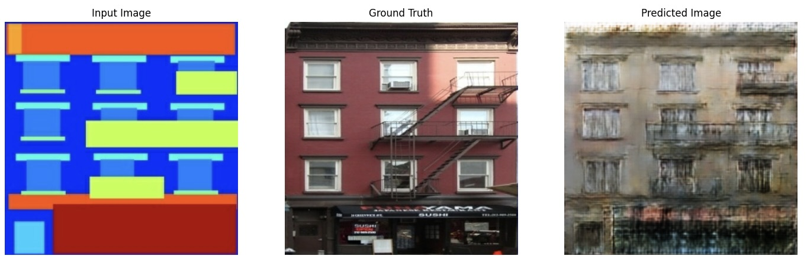
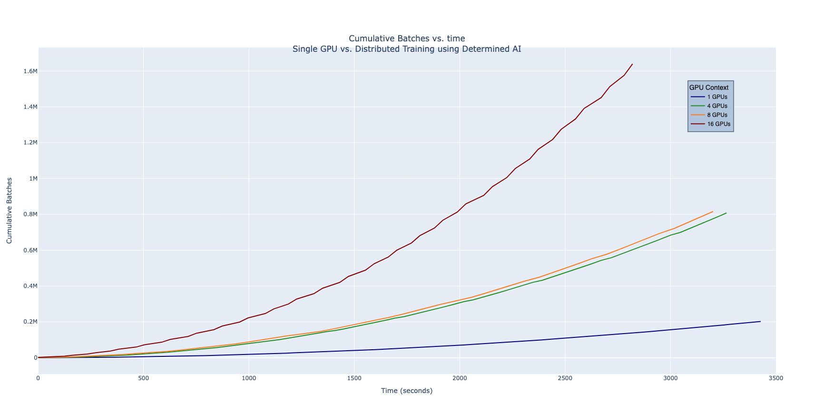
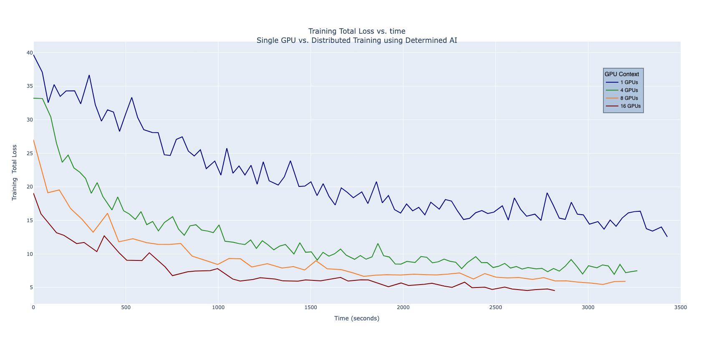
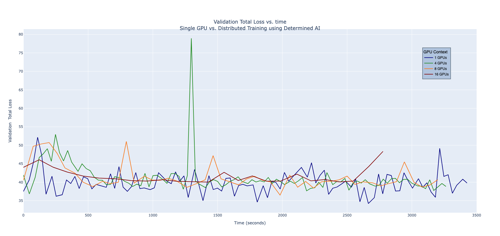

# Pix2pix TensorFlow Keras GAN Example

This example demonstrates how to build a Generative Adversarial Network (GAN) for the pix2pix dataset using Determined's TensorFlow Keras API. It is adapted from [this TensorFlow tutorial](https://www.tensorflow.org/tutorials/generative/pix2pix).

The original paper this model is based on is [Image-to-Image Translation Using Conditional Adversarial Networks](https://arxiv.org/pdf/1611.07004v1.pdf). The original code is [on GitHub](https://github.com/phillipi/pix2pix).

The datasets are located [here](http://efrosgans.eecs.berkeley.edu/pix2pix/datasets/). This examples uses the "facades" dataset. Other datasets (cityscapes, night2day, etc.) may be used by editing the configuration files, but note that some of these are significantly larger.

## Files
* **`pix2pix/__init__.py`**: Defines the `Pix2Pix` subclass of `tf.keras.Model` and the custom `train_step` and `test_step` methods.
* **`pix2pix/discriminator.py`**: Defines the U-Net structure of the discriminator.
* **`pix2pix/generator.py`**: Defines the U-Net structure of the generator.
* **`pix2pix/sampling.py`**: Defines the "upsampling" and "downsampling" patterns used in the discriminator and generator.
* **`data.py`**: Code for loading and preprocessing the data.
* **`export.py`**: Exports a training checkpoint and uses it to generate images.
* **`fit.py`**: Trains the Keras model _without_ using Determined.
* **`model_def.py`**: Wraps the model, optimizers, and datasets using Determined and provides the entrypoint.
* **`print_models.py`**: Generates images showing the layers structure of the discriminator and generator.

### Configuration Files
* **`adaptive.yaml`**: Train the model using the Asynchronous Successive Halving Algorithm for hyperparameter searching.
* **`const.yaml`**: Train the model with constant hyperparameter values.
* **`distributed.yaml`**: Same as `const.yaml`, but use multiple GPUs for distributed training.

## Running Code
See the [Determined installation instructions](https://docs.determined.ai/latest/index.html).
Create an experiment with
```
det --master-url <host:port> experiment create const.yaml .
```

## Exporting Checkpoints and Generating Test Images
Once a model has been trained, its top (or latest) checkpoint can be exported and used to generate images with
```
python export.py --master-url <host:port> --trial-id <trial_id> [--latest]
```

The following image was created using a model trained with `const.yaml`.


## Results
The following plots show differences in performance made when utilizing GPUs with the Determined distributed system.


