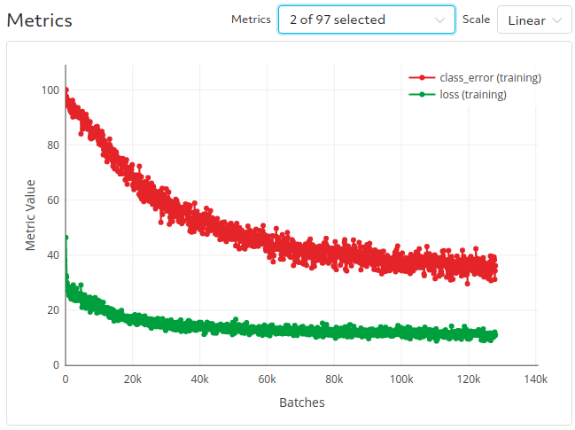
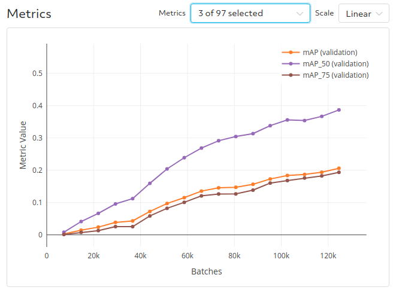

# End-to-end Object Detection with Transformers (Carion et al. 2020)
This example implements the Detection Transformers (DETR) model introduced by Carion et al. (2020) in their [recent paper](https://arxiv.org/abs/2005.12872).  
DETR drastically simplifies the object detection pipeline by doing away with complex postprocessing steps required by most other architectures to extract bounding boxes.  
In place of proposals, anchors, and window centers, DETR directly optimizes a set prediction loss to learn where to focus.  

This implementation largely uses the original implementation provided in [this repo](https://github.com/facebookresearch/detr).  With this Determined implementation, you can easily run DETR with distributed training and hyperparameter search by modifying a few flags in the [experiment config](distributed.yaml).  Note that the panoptic segmentation task is not supported in this example.

## Files
This example is structure as follows:
* [model_def.py](model_def.py): initializes the data, optimizer, and model and specifies the training and evaluation steps.
* [model.py](model.py): modifies the original [SetCriterion function](https://github.com/facebookresearch/detr/blob/master/models/detr.py#L83) to use horovod allreduce to sync number of bounding boxes.
* [data.py](data.py): creates a CocoDetection dataset to work with Google Cloud Storage. 

### Configuration Files
* [const_fake.yaml](const_fake.yaml): single-GPU experiment to run with fake data.
* [distributed.yaml](distributed.yaml): distributed training experiment to run with COCO dataset on Google Cloud Storage.
* [finetune.yaml](finetune.yaml): finetune pretrained model on a subset of classes in COCO.
* [finetune_adaptive.yaml](finetune_adaptive.yaml): perform HP search for a finetuned model on a subset of classes in COCO.

## Data
This example requires the COCO 2017 Object Detection dataset.  There are different backends that you can select for accessing the data (see [data.py](data.py)): aws, gcs, local, and fake.  
* The aws backend will download iamges from an S3 bucket.  
* The gcs backend will download images from a Google Cloud Storage bucket.
* The local backend will download the COCO dataset directly from source to the harddrive and read images from disk.
* The fake backend will use a fake image without requiring COCO to be available anywhere.  

You can choose a different backend by modifying the `backend` field in the experiment config. 

## To Run
Unless you plan to run with fake data, you'll need to have access to the COCO 2017 dataset in either cloud storage or the local disk (see https://cocodataset.org/#home for download instructions). 
Once you have the dataset set up, modify the experiment config you want to run with the desired `backend` and fill in the `data_dir` field with the bucket name if using gcs or aws backend, or data directory if using the local backend.

Then, submit the experiment to your Determined cluster by running
```
det experiment create <distributed.yaml> .
```
from the command line.

## Results
The training and validation curves corresponding to the `distributed.yaml` experiment config are shown below.  They closely match the [results for the 150 epoch learning rate schedule provided in the original repo](https://gist.github.com/szagoruyko/b4c3b2c3627294fc369b899987385a3f).



