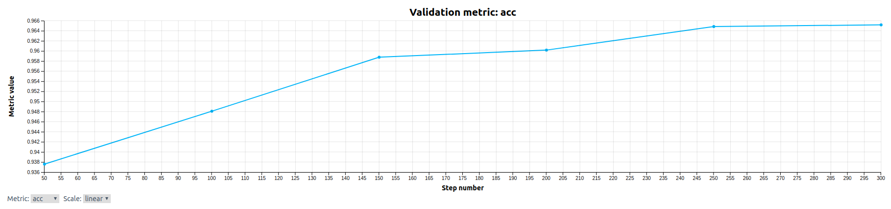

# Prototypical Networks on Omniglot
This example implements a popular meta-learning method called prototypical networks (ProtoNets)
for few-shot learning on the Omniglot dataset.  ProtoNets often outperform MAML on few-shot learning problems.
Please consult the original [paper](http://papers.nips.cc/paper/6996-prototypical-networks-for-few-shot-learning.pdf)
and [code](https://github.com/jakesnell/prototypical-networks) published by the author for more details.

## Files
* **model_def.py**: The core code for the model. This includes building and compiling the model.
* **data.py**: The code used to generate few-shot learning tasks.
* **startup-hook.sh**: Script that will be run automatically by Determined in each container launched for this experiment. The script installs an additional dependency and invokes `fetch_data.sh` to download the training data.
* **fetch_data.sh**: Script to download the Omniglot data.

### Configuration Files
* **20way1shot.yaml**: The 20-way 1-shot configuration for the experiment.
* **20way5shot.yaml**: The 20-way 5-shot configuration for the experiment.

### Data
We use the Omniglot download script from the [meta-blocks](https://github.com/alshedivat/meta-blocks/blob/master/benchmarks/omniglot/fetch_data.sh) repo.
This script is called in `startup-hook.sh` so the data folder is available prior to
starting the trial and should take less than 15 seconds to run.

## To Run
If you have not yet installed Determined, installation instructions can be found
under `docs/install-admin.html` or at https://docs.determined.ai/latest/index.html

Run the following command: `det -m <master host:port> experiment create -f
20way1shot.yaml .`. The other configurations can be run by specifying the appropriate
configuration file in place of `20way1shot.yaml`.

## Results
For 20-way 1-shot classification on Omniglot, this implementation should reach ~96% test accuracy
in 20k batches and converge to over 97% (beating the published 96% result in the original paper).
See an example learning curve below:

