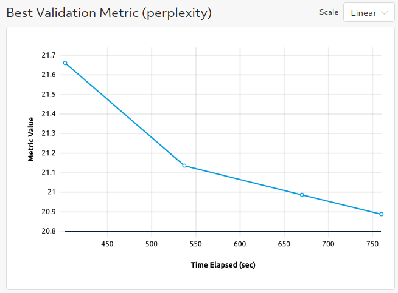
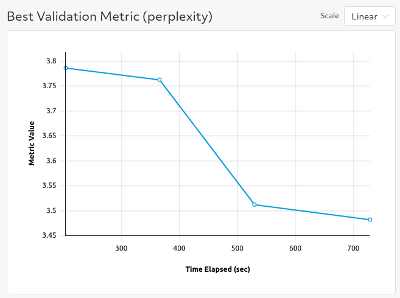
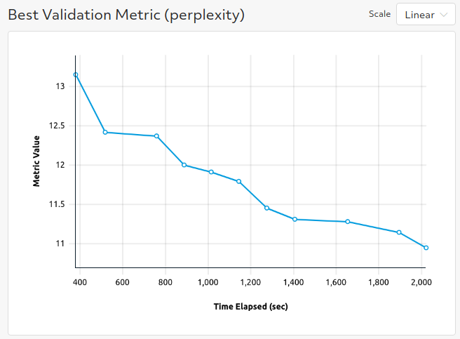

# Language Modeling
The examples here mirror the [language-modeling examples](https://github.com/huggingface/transformers/tree/master/examples/pytorch/language-modeling) from the original huggingface transformers repo.

You can finetune GPT and GPT-2 with the causal language model (CLM); ALBERT, BERT, DistilBERT, and RoBERTa with the masked language model(MLM); and XLNet with the permutation language model (PLM).

## Files
* **clm_trial.py**: The [PyTorchTrial definition](https://docs.determined.ai/latest/reference/api/pytorch.html#pytorch-trial) for CLM. A few class methods are overwritten and specialized for text classification but otherwise the behavior is the same as the [BaseTransformerTrial class](../model_hub/transformers/_trial.py).
* **mlm_trial.py**: The [PyTorchTrial definition](https://docs.determined.ai/latest/reference/api/pytorch.html#pytorch-trial) for MLM. A few class methods are overwritten and specialized for text classification but otherwise the behavior is the same as the [BaseTransformerTrial class](../model_hub/transformers/_trial.py).
* **plm_trial.py**: The [PyTorchTrial definition](https://docs.determined.ai/latest/reference/api/pytorch.html#pytorch-trial) for PLM. A few class methods are overwritten and specialized for text classification but otherwise the behavior is the same as the [BaseTransformerTrial class](../model_hub/transformers/_trial.py).

### Configuration Files
* **clm_config.yaml**: Experiment configuration for finetuning on WikiText-2 with GPT2.  
* **mlm_config.yaml**: Experiment configuration for finetuning on WikiText-2 with RoBERTa.
* **plm_config.yaml**: Experiment configuration for finetuning on WikiText-2 with XLNet.

## Configuration
To run with your own data, change the following fields in either of the experiment configurations:
* `dataset_name: null` (This needs to be `null` so that we know to use the file paths specified below.)
* `train_file: <path_to_train_file>`
* `validation_file: <path_to_validation_file>`

If you want to use custom data, the `train_file` and `validation_file` need to be in either csv or 
json format. See the trial definition for more guidance on how to use custom data files.  

To run with multiple GPUs (whether single node or multiple nodes), change `slots_per_trial` to the desired
degree of parallelism.  You will likely want to change `global_batch_size` so that each GPU will
process `global_batch_size / slots_per_trial` batches per iteration and adjust the `learning_rate`
to be compatible with a larger or smaller batch size.  

Mix precision training with Apex Amp can be enabled by setting `use_apex_amp` to `true`.  

## To Run
If you have not yet installed Determined, installation instructions can be found
under `docs/install-admin.html` or at https://docs.determined.ai/latest/index.html

Make sure the environment variable `DET_MASTER` is set to your cluster URL.
Then you run the following command from the command line: `det experiment create -f <experiment_config> .`. 

## Results
* Using the provided experiment config `clm_config.yaml` yields a perplexity of ~20-21.

* Using the provided experiment config `mlm_config.yaml` yields a perplexity of ~3.5.

* Using the provided experiment config `plm_config.yaml` yields a perplexity of ~11.

