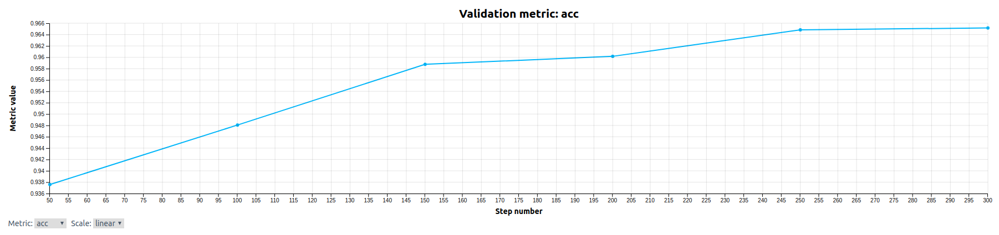

## Prototypical Networks on Omniglot
This example implements a popular meta-learning method called prototypical networks (ProtoNets) for few-shot learning on the Omniglot dataset.  ProtoNets often outperform MAML on few-shot learning problems.
Please consult the original [paper](http://papers.nips.cc/paper/6996-prototypical-networks-for-few-shot-learning.pdf) and [code](https://github.com/jakesnell/prototypical-networks) published by the author for more details.

### Folders and Files
* **model_def.py**: Contains the core code for the model and protonet loss function following Determined's PyTorchTrial interface.
* **data.py**: Contains the code used to generate few-shot learning tasks.
* **20way1shot.yaml**: Contains the configuration for the experiment. 
* **startup-hook.sh**: Script run before starting the trial that downloads the Omniglot data.
* **fetch_data.sh**: Script to download the Omniglot data.

### Data
We use the Omniglot download script from the [meta-blocks](https://github.com/alshedivat/meta-blocks/blob/master/benchmarks/omniglot/fetch_data.sh) repo.  This script is called in `startup-hook.sh` so the data folder is available prior to starting the trial and should take less than 15 seconds to run.

### To Run
   *Prerequisites*:  
      Installation instruction found under `docs/install-admin.html` or at [Determined installation page](https://docs.determined.ai/latest/index.html).

   After configuring the settings in 20way1shot.yaml. Run the following command:
     `det -m <master host:port> experiment create -f 20way1shot.yaml . `

### Expected Result
For 20-way 1-shot classification on Omniglot, this implementation should reach ~96% test accuracy in 20k batches and converge to over 97% (beating the published 96% result in the original paper).  See an example learning curve below.

