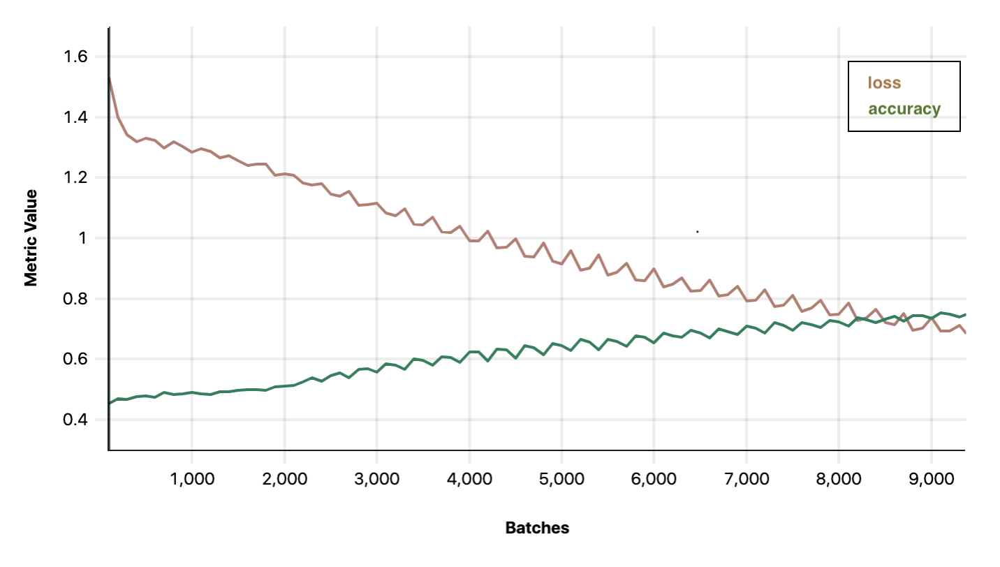

# Tensorflow Multi-class Text Classification Example

This example demonstrates how to integrate and train a Tensorflow model on Determined's API. 
We will implement a multiclass classifier that will be trained to perform sentiment 
analysis on a dataset of Amazon product reviews, classifying reviews into 5 categories (0-5 stars). 
It is adapted from Tensorflow's
[word embedding](https://www.tensorflow.org/tutorials/text/word_embeddings) tutorial.

## Files
* `model_def.py`: main trial class for your model containing the model definition, initialization
  methods, and methods for loading training and validation data.
  
* `data.py`: methods for downloading and processing data and datasets for use in the model

###Configuration Files
* `const.yaml`: model training with constant hyperparameter values
* `distribyted.yaml`: trains the model with multiple GPUs (distributed training)
* `adaptive.yaml`: performs hyperparameter search on specified hyperparameter values

##Data
This example uses [UCSD's Amazon review datasets](http://deepyeti.ucsd.edu/jianmo/amazon/) but can be easily adapted to 
use any other categorical text-based dataset.

##Running the Experiment
If you have not yet installed Determined, installation instructions can be found under docs/install-admin.html or at 
https://docs.determined.ai/latest/index.html

Run the following command:

`det -m <master host:port> experiment create -f adaptive.yaml .`

The other configurations can be run by specifying the appropriate configuration file in place of adaptive.yaml.

##Sample Results
Example of running a trial with default configurations in `const.yaml` and expected convergence.

