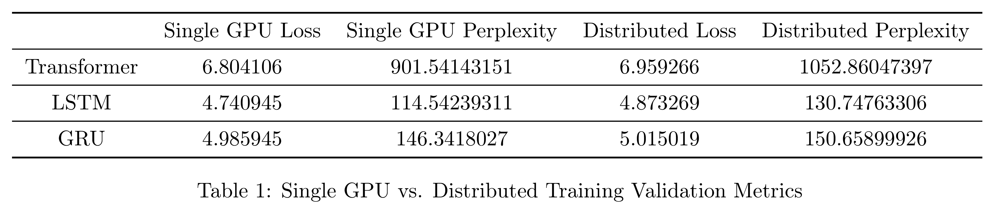

# PyTorch Word-Level Language Modeling Example

This example shows how to build the RNN and Transformer word-level language modeling models
on the WikiText-2 dataset using Determined's PyTorch API. This example is adapted 
from this [PyTorch Word-Level Language Modeling example](https://github.com/pytorch/examples/tree/master/word_language_model).

## Files
* **model.py**: This file defines both models - the RNN and the Transformer.
* **data.py**: The data loading and preparation code for the model. Unless `use_cache: False` is specified in the experiment config file, this code will attempt to load a cached version of the preprocessed data. If the cached version is unavailable, it will download and preprocess the data, and cache it for future use.
* **model_def.py**: The core code for training. This includes building and compiling the model.

### Configuration Files
* **const.yaml**: Train the model on a single GPU with constant hyperparameter values.
* **distributed.yaml**: Same as `const.yaml`, but trains the model with 8 GPUs (distributed training).

## Data
The data used for this example is downloaded from [Salesforce Einstein](https://www.salesforce.com/products/einstein/ai-research/the-wikitext-dependency-language-modeling-dataset/) at the start of each run. This is the same source as the original example.

## To Run
If you have not yet installed Determined, installation instructions can be found
under `docs/install-admin.html` or at https://docs.determined.ai/latest/index.html

Run the following command: `det -m <master host:port> experiment create -f 
const.yaml .`. The other configurations can be run by specifying the appropriate 
configuration file in place of `const.yaml`.

### Specifying the Model
This example defines 4 models - a Transformer, a recurrent neural network with LSTM cells,
a recurrent neural network with GRU cells, and a recurrent neural network with a simple RNN cell with a `tanh` activation.

To specify which model to use, replace the `model_cls` attribute in the appropriate .yaml file with one of the following:
* `Transformer`
* `LSTM`
* `GRU`
* `RNN`

## Results
Note: The purpose of this table is to show the word language modeling models running in Determined 
for a set number of epochs, demonstrating the acceleration of model training time 
achieved with Determined’s distributed training.

