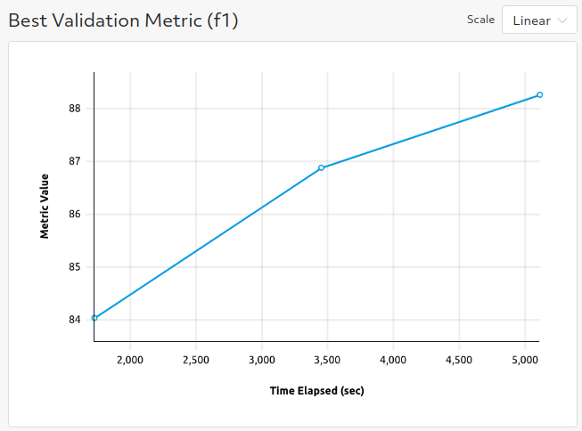
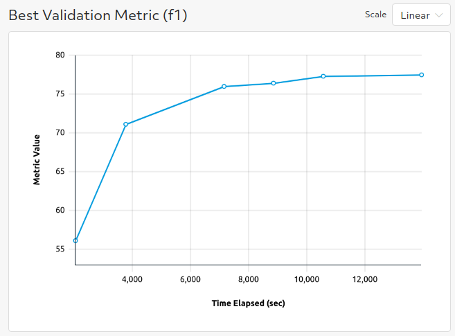
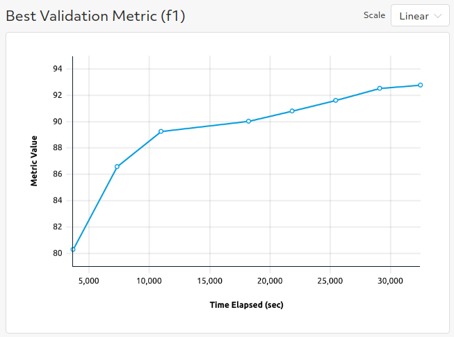
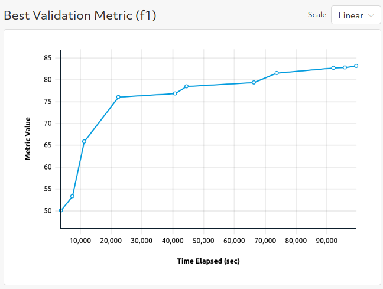

# Question Answering
The examples here mirror the [question answering examples](https://github.com/huggingface/transformers/tree/master/examples/pytorch/question-answering) from the original huggingface transformers repo.

## Files
* **qa_trial.py**: The [PyTorchTrial definition](https://docs.determined.ai/latest/reference/api/pytorch.html#pytorch-trial) for question-answering on SQuAD. A few class methods are overwritten and specialized for text classification but otherwise the behavior is the same as the [BaseTransformerTrial class](../model_hub/transformers/_trial.py).
* **data.py**: data pre and post-processing for question answering.
* **qa_beam_search_trial.py**: The [PyTorchTrial definition](https://docs.determined.ai/latest/reference/api/pytorch.html#pytorch-trial) for question-answering with beam search. A few class methods are overwritten and specialized for text classification but otherwise the behavior is the same as the [BaseTransformerTrial class](../model_hub/transformers/_trial.py).
* **data_beam_search.py**: data pre and post-processing for question answering with beam search.

### Configuration Files
* **squad.yaml**: Experiment configuration for finetuning on SQuAD.
* **squad_v2.yaml**: Experiment configuration for finetuning on SQuAD version 2.
* **squad_beam_search.yaml**: Experiment configuration for finetuning on SQuAD with beam search.
* **squad_v2_beam_search.yaml**: Experiment configuration for finetuning on SQuAD version 2 with beam search.

## To Run
If you have not yet installed Determined, installation instructions can be found
under `docs/install-admin.html` or at https://docs.determined.ai/latest/index.html

Make sure the environment variable `DET_MASTER` is set to your cluster URL.
Then you run the following command from the command line: `det experiment create -f <experiment_config> .`. 

## Configuration
To run on SQuAD version 2, you will need to make sure that the `dataset_name` is set to `squad_v2` and
`version_2_with_negative` is set to `true`.  

To run with your own data, change the following fields in either of the experiment configurations:
* `dataset_name: null` (This needs to be `null` so that we know to use the file paths specified below.)
* `train_file: <path_to_train_file>`
* `validation_file: <path_to_validation_file>`

If you want to use custom data, the `train_file` and `validation_file` need to be in either csv or 
json format.   Additionally, the data should be structured in the same way as SQuAD; you may need to tweak the data processing
functions to work with your own dataset.  See the trial definition for more guidance on how to use custom data files.  

To run with multiple GPUs (whether single node or multiple nodes), change `slots_per_trial` to the desired
degree of parallelism.  You will likely want to change `global_batch_size` so that each GPU will
process `global_batch_size / slots_per_trial` batches per iteration and adjust the `learning_rate`
to be compatible with a larger or smaller batch size.  

Mix precision training with Apex Amp can be enabled by setting `use_apex_amp` to `true`.  

## Results
* Using the provided experiment config `squad.yaml` should yield an F1 score >88 on SQuAD.

* Using the provided experiment config `squad_v2.yaml` should yield an F1 score ~77 on SQuAD version 2.

* Using the provided experiment config `squad_beam_search.yaml` should yield an F1 score ~92.7 on SQuAD.

* Using the provided experiment config `squad_v2_beam_search.yaml` should yield an F1 score >83 on SQuAD version 2.

