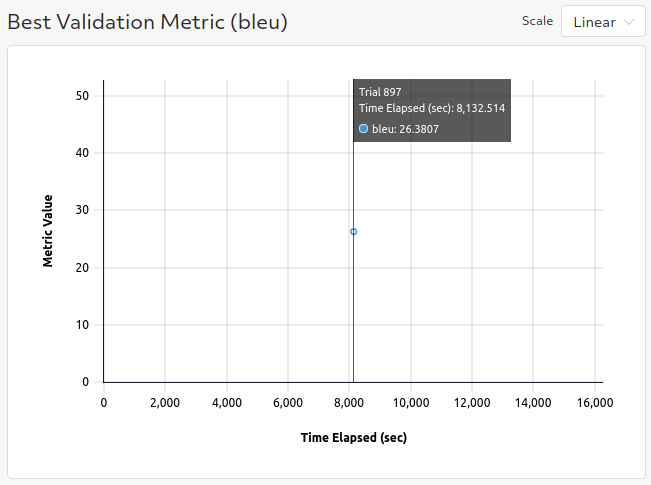
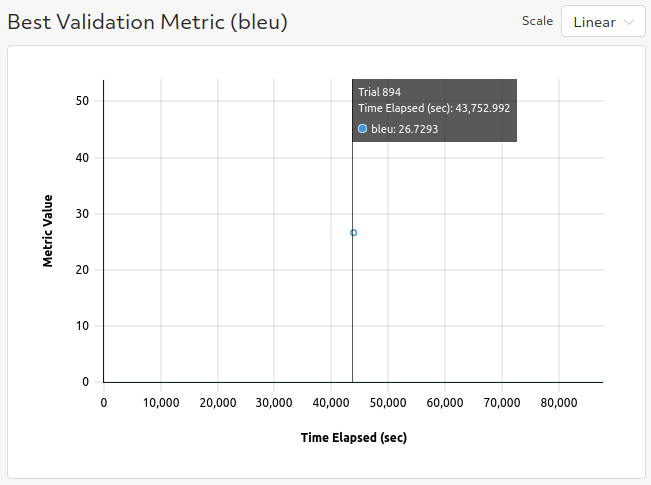

# Translation 
This example mirrors the [translation example](https://github.com/huggingface/transformers/tree/master/examples/pytorch/translation) from the original huggingface transformers repo for translation.

## Files
* **translation_trial.py**: The [PyTorchTrial definition](https://docs.determined.ai/latest/reference/api/pytorch.html#pytorch-trial) for this example. A few class methods are overwritten and specialized for translation but otherwise the behavior is the same as the [BaseTransformerTrial class](../model_hub/transformers/_trial.py).

### Configuration Files
* **marianmt_config.yaml**: Experiment configuration file for finetuning on the WMT 2016 English to Romanian translation task with [a model based on Marian-NMT](https://github.com/Helsinki-NLP/Opus-MT).  
* **t5_config.yaml**: Experiment configuration file for finetuning on the WMT 2016 English to Romanian translation task with a `t5-small` model.
* **mbart_config.yaml**: Experiment configuration file for finetuning on the WMT 2016 English to Romanian translation task with a `mbart-large` model.

## To Run
If you have not yet installed Determined, installation instructions can be found
under `docs/install-admin.html` or at https://docs.determined.ai/latest/index.html

Make sure the environment variable `DET_MASTER` is set to your cluster URL.
Then you run the following command from the command line: `det experiment create -f marianmt_config.yaml .`. 

## Configuration
To run with your own data, change the following fields in `ner_config.yaml`:
* `dataset_name: null` (This needs to be `null` so that we know to use the file paths specified below.)
* `train_file: <path_to_train_file>`
* `validation_file: <path_to_validation_file>`

The `train_file` and `validation_file` need to be in either csv or json format.  By default, we follow the original example and
use a basic call to the `load_dataset` from the [huggingface datasets library](https://huggingface.co/docs/datasets) to parse the provided files.  
For more customized data loading, follow the instructions at https://huggingface.co/docs/datasets/loading_datasets.html.

To run with multiple GPUs (whether single node or multiple nodes), change `slots_per_trial` to the desired
degree of parallelism.  You will likely want to change `global_batch_size` so that each GPU will
process `global_batch_size / slots_per_trial` batches per iteration and adjust the `learning_rate`
to be compatible with a larger or smaller batch size.  

Mix precision training with Apex Amp can be enabled by setting `use_apex_amp` to `true`.  

## Results
- Running with the provided experiment config `marianmt_config.yaml` yields a BLEU score of >25.
- 
- Running with the provided experiment config `t5_config.yaml` yields a BLEU score of >26.
- 
- Running with the provided experiment config `mbart_config.yaml` yields a BLEU score of >26.5.
- 
