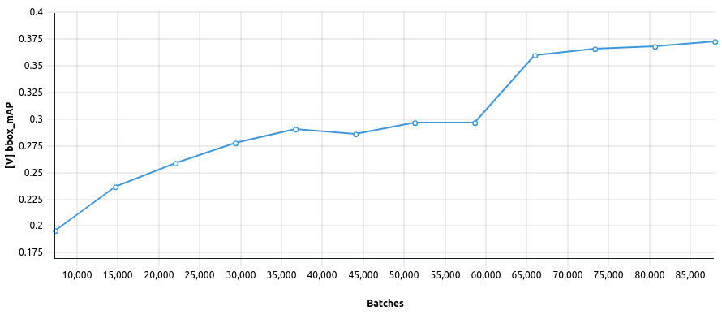

# MMDetection
We have provided a default [Determined experiment configuration for Mask-RCNN on COCO 2017](./maskrcnn.yaml) as the starting point.

## Configuring MMDetection
MMDetection has [its own configuration system](https://mmdetection.readthedocs.io/en/latest/tutorials/config.html) for specifying the dataset, model, optimizer, and other objects used during training.  Customizing MMDetection primarily amounts to specifying
your own MMDetection configs and we preserve this when using MMDetection with Determined.  Hence, similar to directly using MMDetection, you will need to be familiar with MMDetection's configurable objects in order to get more custom behavior.

We will cover how to specify and manipulate a *MMDetection config* in the experiment configuration below.  

### Specifying a predefined MMDetection config
The easiest way to specify a MMDetection config is to use one of [the provided ones](https://github.com/open-mmlab/mmdetection/tree/master/configs).  The configs in this folder are already available in the docker image that we build for use with model-hub MMDetection at `/mmdetection/configs`.  You can specify a path to the MMDetection config by changing the `config_file` filed under `hyperparameters`. 

For example:

```
hyperparameters:
  config_file: /mmdetection/configs/faster_rcnn/faster_rccn_r50_fpn_1x_coco.py
```

This field is required and you can either use an existing config in the `/mmdetection/configs` directory of the `determinedai/model-hub-mmdetection` docker image or provide a path to your own MMDetection config in this experiment context.

### Merging a config file
You can also specify a file to merge into and override the values in the MMDetection config loaded from `hyperparameters.config_file`.  
The format should be the same as that for MMDetection config files.  Suppose we saved a file called `merge_config.py` with
the below lines to override the optimizer:
```python
optimizer = dict(                                                                                   
    type='AdamW',                                                                                   
    lr=0.0001,                                                                                      
    weight_decay=0.0001,                                                                            
)
```

Then to apply it, you just need to modify the experiment config as follows:

```
hyperparameters:
  merge_config: ./merge_config.py
```

### Overriding config fields
Finally, if you only want to override a few fields of the MMDetection config, you can use the 
`override_mmdet_config` section under `hyperparameters`.  The overrides here will be applied last 
and hence take precedence over the values from a merged file if specified.
You can indicate nested config structure by using a `.` to indicate a child of a field.  For example, 
you can add the following to `hyperparameters.override_mmdet_config` to change the learning rate:

```
hyperparameters:
  override_mmdet_config:
    optimizer.lr: 0.005
```

There are provided examples commented out in the default config that show how to use the override
field to turn on gradient clipping and mixed precision.  

### Other experiment config fields
#### Data backends
We support `s3`, and `gcs` backends in addition to the [file client backends supported by MMCV](https://mmcv.readthedocs.io/en/latest/_modules/mmcv/fileio/file_client.html#FileClient) so you can easily access data in cloud storage buckets.  Note that MMDetection expects the data to follow [a particular structure for standard datasets](https://mmdetection.readthedocs.io/en/latest/1_exist_data_model.html#test-existing-models-on-standard-datasets) like COCO, Pascal, Cityscapes.

You can change the backend by modifying the `data.file_client_args` section of the experiment config.

#### Batch sizes
The `hyperparameters.global_batch_size` field of the Determined experiment config is required and must be filled in when submitting the experiment.  If you want it to match a given MMDetection config, you should set it to `data.samples_per_gpu * world_size`.

#### Using pretrained weights
MMDetection provides pretrained checkpoints corresponding to some of the configurations as listed in the `README` files for each model type.  If a pretrained weight is available for the specified `config_file`, you can warmstart the model with these weights by setting `hyperparameters.use_pretrained` to `true`.  

## Using custom dataset
Training MMDetection on custom datasets in Determined is largely the same process as doing so directly with MMDetection.  Please follow [this guide](https://mmdetection.readthedocs.io/en/latest/tutorials/customize_dataset.html) from MMDetection to register your own datasets.

## Adding classes
Creating custom classes for models, otpimizers, losses, and other MMDetection objects also requires following the same process as you would normally.  Please see the [MMDetection tutorials](https://mmdetection.readthedocs.io/en/latest/tutorials/customize_models.html) for more info.

## Results
The validation bounding box mAP for Faster-RCNN is shown in the image below.



## To Run
If you have not yet installed Determined, installation instructions can be found
under `docs/install-admin.html` or at https://docs.determined.ai/latest/index.html

Make sure the environment variable `DET_MASTER` is set to your cluster URL.
Then you run the following command from the command line: `det experiment create -f <experiment_config> .`. 

For modular and composable configuration, please check out how to [use MMDetection with Facebook's hydra](./hydra/README.md`).
