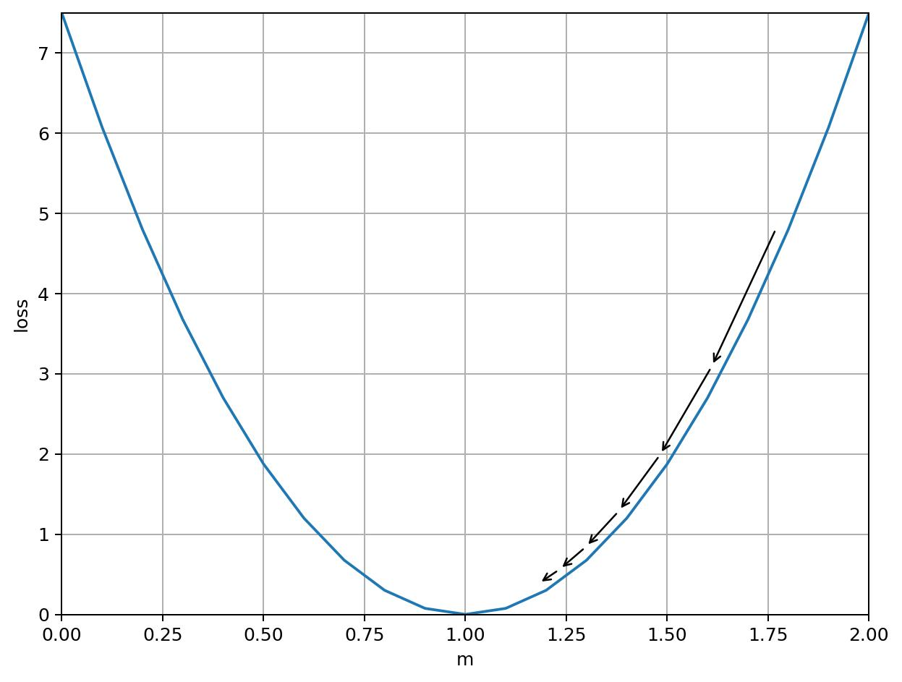

# Part 1: Backpropagation

Machine learning is all about getting computers to solve math problems for you.

Specifically, it's about solving math problems like, "For a given mathematical
model, what weights in the model would cause the model to calculate the most
accurate predictions for a set of inputs?"

You're going to write code to solve this exact problem for one particularly
simple model.

Afterwards, you will understand of basic concepts like gradient descent and
batch size.  You will also understand how those basic concepts translate into
some of Determined's advanced features, like gradient aggregation,
data-parallel distributed training, and model-parallel distributed training.

## The Model

Our model is going to be be a simple linear model: `ypred = m*x` (`pred` is
short for "predicted"). In statistics they would say there is no bias term, or
in algebra they would there's no constant term.  Just a stright line through
the origin.

## The Data Set

Our made-up dataset has 4 data points:

- `(x=1, ylabel=1)`
- `(x=2, ylabel=2)`
- `(x=3, ylabel=3)`
- `(x=4, ylabel=4)`

## The Math Problem

What is the best value of `m` to make our model (`ypred = m*x`) most-accurately
predict our dataset?

### Q1:

The answer is `m=1`.  Looking at the dataset, explain why `m=1` is correct
before proceeding with further math.

## What does "most-accurately" mean, really?

For this model and dataset, there is an exact answer (`m`=1), but usually there
isn't.  So usually instead of seeking an exact answer, we are really seeking to
minimize a function, called the "loss", that mathematically describes the
goodness-of-fit between our model and the data.  There are lots of loss
functions, but we're going to use the least-squares error function, sometimes
abbreviated LSE.  It is defined as the sum of the squares of the error between
our labels (the `y` values of our dataset) and our predictions (the output `y`
of our `y=m*x` model).

So for data points `(x0, ylabel0)`, `(x1, ylabel1)` and corresponding
predictions `ypred0`, `ypred1`, you would calculate the LSE as:

    loss = (ylabel0 - ypred0)**2 + (ylabel1 - ypred1)**2

### Q2:

Complete the following table, calculate the loss for each point of our dataset
if we set `m=2` in our model:

|  x  | ylabel | ypred | `(ylabel - ypred)**2` |
| --- | ------ | ----- | --------------------- |
|  1  |   1    |       |                       |
|  2  |   2    |       |                       |
|  3  |   3    |       |                       |
|  4  |   4    |       |                       |

Write a function for calculating the LSE loss for a single `(x, ylabel)` data
pair.  It should take `m` and a single `(x, ylabel)` pair as inputs and return
the loss.

Then write a function for calculating the LSE loss for a whole dataset.  It
should take `m` and a list of `(x, ylabel)` pairs and return the LSE loss.

Is it possible to write the second function by making multiple calls to the
first function and combining the results?  Why or why not?

## Minimizing the loss

We have the loss, but what do we do to minimize it?  The answer is called
"Gradient Descent".  We basically follow the curve of our loss until we get to
the minimum of the loss graph:



That image is pulled from from [this youtube video series](
https://www.youtube.com/watch?v=b4Vyma9wPHo) which explains a lot of the
details here in greater detail, if you want that.

The basic idea is that we look at the slope of the loss curve (or the "gradient"
of the loss curve if our loss is more than two dimensional), and try to take a
step in the direction of the minimum.

The direction of our step is based on the sign of the slope.  If the slope is
positive, we know the minimum must be to our left, so we move in the negative
direction (decreasing `m`).

The size of our step is based on the magnitude of the slope.  If the slope is
really steep, we proably can afford to take a really big step, but if it's
really small we think we're getting close to the slope and we only take a small
step.

So let's define the step size `mstep` as:

    mstep = - gradient * lr

where `lr` is a constant multiplier, commonly called the "learning rate".

But where does that `gradient` term come from?

## The Gradient

In the case of our simple model, we can use calculus to calculate the slope of
our loss with respect to `m`, which for a one-variable model is also the
gradient of the loss.

We'll start by writing the loss for a single data point in terms of `m`:

    loss = (ylabel - ypred)**2
    loss = (ylabel - (m * x))**2

Then apply the product rule and the chain rule from to get the derivative with
respect to the weight `m`:

    dloss/dm = - 2*x (ylabel - m*x)

### Q3:

Write a function to caclulate the gradient for a single data point.  It should
take `m` and a single `(x, ylabel)` pair as inputs and return.

Then write a function to calculate the total gradient for a list of
`(x, ylabel)` pairs.

Is it possible to write the second function by making multiple calls to the
first function and combining the results?  Why or why not?

## Autodifferentiation

We solved our gradient symbolically because it was so simple.  But real
gradients in real models are calculated with some magic called
"autodifferentiation".

You don't need to understand autodifferentiation, but you do need to
understand:
- it starts in the the "forward" pass of training a batch, and finishes in
  the "backward" pass, and
- it is additive.

The "forward" pass is when a model makes a prediction, and the loss is
calculated by comparing the label to the prediction.  During the forward pass,
the deep learning library keeps information on how every weight in the model
affects the output.  Then the "backward" pass takes the calculated loss and
figures out how chaning each weight would affect the loss.  This output is the
gradient.  In our toy model, the gradient is just a single number because we
have just a single parameter (`m`), but in a model with a billion parameters the
gradient is a billion numbers long.

The additive part is important.  If you do a forward pass on a particular data
point, follwed by a backward pass, you'll have some gradient.  If you
immediately do another forward pass on the same data, followed by another
background pass, you'll have twice the gradient as before.  If you do it one
more time, you'll have three times the original gradient.

### Q4:

The additive nature of autodifferentiated gradients is important to
understanding the features that Determined offers.

Explain in your own words _why_ autodifferentiated gradients are additive.

## Training by Gradient Descent

The basic gradient desent loop algorithm is:

1. Pick an initial model weight.
2. Select one or more `(x, ylabel)` pairs from the dataset.
3. Calculate a prediction for the selected inputs with a label (Q2).
4. Calculate the gradient using the prediction vs label (Q3).
5. Subtract `gradient * lr` from our model weight ("Minimizing the loss").
6. Repeat steps 2—5 until you decide to stop.

### Q5

Write a training loop to do gradient descent on our `ypred = mx` model.  Your
function should take the following inputs:

- initial model weight `m`
- a learning rate `lr` for calculating the setp
- a dataset, which is a list of `(x, ylabel)` data pairs
- a number of iterations to do (one "iteration" is steps 2-5).

Your function should return the final trained weight `m`.

Additionally, in the "select one or more `(x, ylabel)` input pairs" step, for
now you should just select the next `(x, ylabel)` pair in the dataset, and it
should wrap back to the previous dataset.  So if your dataset is of length 10,
then your eleventh iteration should reuse the first `(x, ylabel)` pair of your
dataset.

Here are some test cases:

```python
dataset = [(1,1)]
mfinal = train_loop(m=0, lr=0.001, dataset=dataset, iterations=1)
assert mfinal == XXX, mfinal

dataset = [(1,1)]
mfinal = train_loop(m=0, lr=0.001, dataset=dataset, iterations=100)
assert mfinal == XXX, mfinal

dataset = [(1,1),(2,2),(3,3),(4,4)]
mfinal = train_loop(m=0, lr=0.001, dataset=dataset, iterations=4)
assert mfinal == XXX, mfinal

dataset = [(1,1),(2,2),(3,3),(4,4)]
mfinal = train_loop(m=0, lr=0.001, dataset=dataset, iterations=100)
assert mfinal == XXX, mfinal
```

### Q6

What happens if you set the learning rate way too low?

```python
dataset = [(1,1),(2,2),(3,3),(4,4)]
mfinal = train_loop(m=0, lr=0.000000001, dataset=dataset, iterations=4)
print("mfinal", mfinal)
```

Explain in words what is happening.

### Q7

What happens if you set the learning rate way too high?

```python
dataset = [(1,1),(2,2),(3,3),(4,4)]
mfinal = train_loop(m=0, lr=10, dataset=dataset, iterations=4)
print("mfinal", mfinal)
```

Explain in words what is happening.

## Batch Size in Training

Your training fuction calculated the gradient for each data point, taking a
step to minimize the loss for that particular point, then moving on to the next
point.  This strategy (considering exactly one batch at a time) is called
"stochastic gradient descent".  It can be an messy process because real gradient
curves are not smooth parabolas like in this example, and taking a step every
data point can cause you to take a lot of steps in the overall wrong direction.

There is also "batch gradient descent", which is where you calculate the total
gradient for your whole dataset (adding up the gradients for every data point
in the whole dataset) before taking a single step.  This is a more reliable way
to minimize the loss than stoachastic gradient descent because by looking at
all data points before stepping, you can be sure you're stepping in the overall
right direction.  However, nobody in deep learning really does this, because the
datasets are normally huge and it would take forever to train a model on a
dataset if you could only step once per epoch.

There is an in-between option, which is more accurate than stochastic gradient
descent but much fatser than batch gradient descent.  It is called "mini-batch
gradient descent", and it's what basically the only gradient descent used in deep
learning.  In mini-batch gradient descent, you have have some `batch_size`,
usually a multiple of 2.  In each iteration of training, you select a
mini-batch of `batch_size` elements, calculate the gradients for that
mini-batch, take a step, and then repeat with the next mini-batch.  Mini-batch
gradient descent is is so universal in our industry that you won't hear anybody
talk about it, and the word "batch" is widely preferred to "mini-batch".

Mini-batch training is especially well-suited to training on GPUs.  Graphics
cards are parallel-processing engines, and since the total gradient for a
batch (no use calling it a "mini-batch" around here) can be calculated in
paralell (by independently calculating the gradients from each data point, and
summing or averaging them together at the end), the time to do a forward and
backward pass on a single data point is approximately equal to the time to do a
forward and backward pass on a whole batch of data.  However, since you are
considering multiple data points for each step, you get a more accurate step in
the same amount of training time.  The upper limit of batch size is how much
GPU memory you have.  Larger batch sizes means you are doing more parallel
calculations at the same time, which requires more memory.

### Q8

Write a variation of your previous training loop, but this time do mini-batch
training and add a `batch_size` parameter.  Note that when you combine
gradients, it is most common to average them, not just to sum them.

Report what you get in the following scenarios:

```python
dataset = [(1,1),(2,2),(3,3),(4,4)]
mfinal = train_loop(m=0, lr=0.001, dataset=dataset, batch_size=2 iterations=4)
assert mfinal = XXX, mfinal

mfinal = train_loop(m=0, lr=0.001, dataset=dataset, batch_size=4 iterations=4)
assert mfinal = XXX, mfinal
```

Why do you get different results when you change the batch size?

## Gradient Aggregation

Determined supports "gradient aggregation", where you calculate multiple
batches of gradients in sequence, combine them with averaging, and then take a
step based on that "aggregated" gradient.

### Q9

Imagine the following pseudocode for implementing gradient aggregation:

```python
batch_a = [(1,1),(2,2)]
batch_b = [(3,3),(4,4)]

grad_a = calc_batch_grad(batch_a)
grad_b = calc_batch_grad(batch_b)

grad_total = (grad_a + grad_b)/2
```

Would you expect the calculated `grad_total` to be different or the same
compared to calcluating `grad_total` from a single batch with all of the data?

```python
batch_total = [(1,1),(2,2),(3,3),(4,4)]
grad_total = calc_batch_grad(batch_total)
```

So what would gradient aggregation be useful for?

## Distributed Training

Perhaps you have so much data that it takes days and days to go through it all
on a single GPU.

Or perhaps you have such a large model, the whole thing doesn't fit on a single
GPU.

It's time for Distributed Training!  Distributed training ("dtrain") means
there are multiple hardware devices (GPUs usually) involved in one training
task.  There are two common types of dtrain:

- Data-parallel dtrain
- Model-parallel dtrain

### Data-Parallel DTrain

In data-parallel dtrain, there are N replicas of a model, each on a different
GPU.  The GPUs may be attached all to one physical node or spread amongst many
nodes.  Each worker calculates a gradient for its own unique shard of the
data, then each workers communicates its results to all other nodes in the
training job, then each worker each applies the average of all worker gradients
to its replica.  Because all workers calculate their step from the same final
averaged gradient, all the model replicas stay in-sync after each step.

The result is that each step of the model is derived from `batch_size *
num_workers` records of data.

### Q10

Imagine you have one worker with one shard:

```python
shard0 = [(1,1),(2,2)]
grad0 = calc_batch_grad(shard0)
all_grads = allgather_grads(grad0)  # communication step
grad_total = sum(all_grads)/len(all_grads)
```

And you have another worker with a different shard:

```python
shard1 = [(3,3),(4,4)]
grad1 = calc_batch_grad(shard1)
all_grads = allgather_grads(grad1)  # communication step
grad_total = sum(all_grads)/len(all_grads)
```

Would you expect each worker's `all_grads` to be the same or different from one
worker calculating a single gradient from the full dataset?  Why?

```python
all_data = [(1,1),(2,2),(3,3),(4,4)]
grad_total = calc_batch_grad(all_data)
```

### Q11

The downside of data-parallel training is all of the network communication
required for every step of the model.  One way to compensate for the network
communication is to combine data-parallel training with gradient aggregation.

How would gradient aggregation help to address the network communication
overhead present in data-parallel training?

### Model-Parallel DTrain

If data-parallel dtrain shards your data across multiple nodes, model-parallel
training shards your model across multiple nodes.  This is important for
training modesl which have too many parameters to fit on any single GPU.

In data parallel dtrain, each worker does its own forward pass, then its own
backward pass, then the workers communicate results.  In model-parallel
training, the forward pass begins on the first few layers of the model, which
exist on the first gpu.  The intermediate output is sent to the next shard on
the next gpu, etc, until the whole model has been run.  Then the backward pass
goes over each shard in reverse, producing the gradient for just one batch.
The training loop steps the model, and repeats with the next batch.
