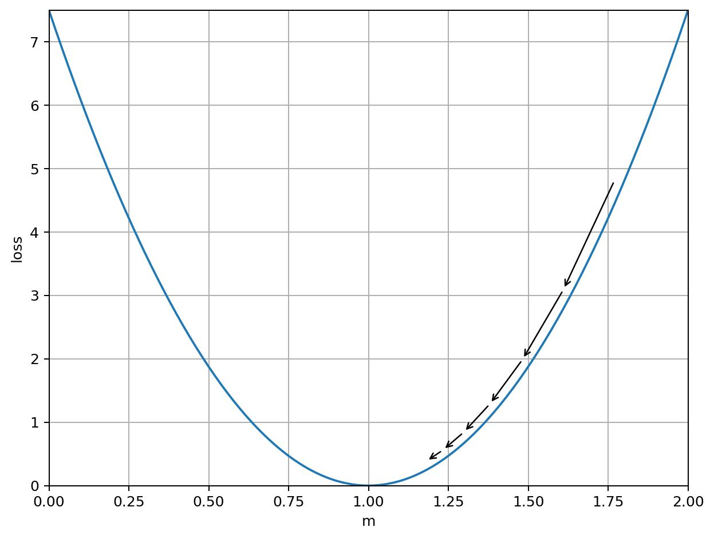

# Part 1: Calculating Gradients and Averaging Them Together

Machine learning is all about getting computers to solve math problems for you.

Specifically, it's about solving math problems like, "For a given mathematical
model, what model weights would result in the most accurate predictions for a
set of inputs?"

In this exercise, you'll write code to solve this exact problem and for one
particularly simple model.

Afterward, you will understand basic concepts like what a gradient is and how
gradient descent works to train models.  You will also understand how many
features in Determined, like batch size, gradient aggregation, and
data-parallel distributed training, really just boil down to different ways of
averaging gradients together during gradient descent.

## The Model

Our model is going to be a simple linear model: `ypred = m*x` (`pred` is
short for "predicted"). In statistics they would say there is no bias term, or
in algebra they would say there's no constant term.  Just a straight line
through the origin.

## The Data Set

Our made-up dataset has 4 data points (`ytrue` indicates "ground truth"):

- `(x=1, ytrue=1)`
- `(x=2, ytrue=2)`
- `(x=3, ytrue=3)`
- `(x=4, ytrue=4)`

## The Math Problem

What is the best value of `m` to make our model (`ypred = m*x`) most accurately
predict our dataset?

### Q1:

The answer is `m=1`.  Looking at the dataset, explain why `m=1` is correct
before proceeding with further math.

## What does "most accurately" mean, really?

For this model and dataset, there is a perfect answer (`m=1`), but usually there
isn't.  So usually instead of seeking a perfect answer, we are really seeking
to minimize a function, called the "loss", that mathematically summarizes how
far off our model predictions are from the data's ground truth.  There are lots
of loss functions, but we're going to work with the Mean Squared Error (MSE)
function.

The MSE definition is just like it sounds: the mean of the squares of the
errors between each ground truth `ytrue` and the corresponding model prediction
`ypred`.  So for `N` data points, we can say:

```math
\mathrm{loss_mse} =
    \frac{
        (\mathrm{ytrue}_1 - \mathrm{ypred}_1)^2
        + ...
        + (\mathrm{ytrue}_N - \mathrm{ypred}_N)^2
    }{N}
```

It should be clear from the above formula that the number of data points in the
MSE loss calculation `N` is just a constant divisor that applies to each term.
Then the MSE becomes the sum of a losses calculated individually for each
point:

```math
\mathrm{loss_point} = \frac{(\mathrm{ytrue} - \mathrm{ypred})^2}{N}
```

And we can expand `ypred = m*x` to rewrite `loss_point` in terms of `m`:

```math
\mathrm{loss_point} = \frac{(\mathrm{ytrue} - m x)^2}{N}
```

### Q2:

Can `loss_point` or `loss_mse` ever be negative?  Why or why not, and does this
make logical sense to you?

### Q3:

With `m=2`, complete the following table by calculating the loss for each
point of our dataset:

|  `x`  | `ytrue` | `ypred` | `loss_point` |
| ----- | ------- | ------- | ------------ |
|   1   |    1    |         |              |
|   2   |    2    |         |              |
|   3   |    3    |         |              |
|   4   |    4    |         |              |

Also calculate the total `loss_mse` for the whole dataset:

| `loss_mse` |
| ---------- |
|            |

### Q4:

Write a function for calculating the total `loss_mse`, which takes as input
the current model weight `m` and a list of data points `[(x, ytrue), ...]`, and
returns the floating-point `loss_mse`.

Make sure it agrees with your answer to Q3.

## Minimizing the loss

We have the loss, but how do we minimize it?  There are many ways, but one of
the simplest and most prevalent techniques in deep learning is called "gradient
descent".  We basically follow the curve of our loss until we get to the
minimum of the loss graph:



The basic idea is that we look at the slope of the loss curve (or the "gradient"
of the loss curve if our loss is more than two-dimensional), and try to take a
step in the direction of the minimum.

The direction of our step is based on the sign of the slope.  If the slope is
positive, we know the minimum must be to our left, so we move in the negative
direction (decreasing `m`).

The size of our step is based on the magnitude of the slope multiplied by a
tunable learning rate parameter, `lr`.  Intuitively,  this means that if the
slope is really steep, we probably can afford to take a really big step, but
if the slope is really small we think we're getting close to the slope and we
only take a small step.

So let's define the step size `mstep` as:

    mstep = - gradient * lr

But where does that `gradient` term come from?

## The Gradient

In the case of our simple model, we can use calculus to calculate the slope of
our loss when plotted against `m` (technically, the "derivative of our loss
with respect to `m`").  In the case of a one-variable model, this is identical
to the gradient of the loss.

We'll start by recalling the definition of `loss_point` in terms of `m`:

```math
\mathrm{loss_point} = \frac{(\mathrm{ytrue} - m x)^2}{N}
```

Then apply the product rule and the chain rule from to get the derivative with
respect to the weight `m`:

```math
\frac{\partial\mathrm{loss_point}}{\partial m} =
    \frac{- 2 x(\mathrm{ytrue} - m x)}{N}
```

And since our total `loss_mse` is just the sum of several `loss_point` values,
we know from calculus that the derivative of the total `loss_mse` is the sum
of the per-point derivatives:

```math
\frac{\partial\mathrm{loss_mse}}{\partial m} =
    \frac{-2}{N} (
        x_1 (\mathrm{ytrue}_1 - m x_1) + ... + x_N (\mathrm{ytrue}_N - m x_N)
    )
```

### Q5:

Write a function to calculate the gradient for a single data point.  It should
take `m`, a single `(x, ytrue)` pair, and `N` as inputs and return
`dloss_point/dm`.

You can test with:

```python
assert grad_point(m=2, data=(1, 1), N=4) == 0.5
assert grad_point(m=2, data=(2, 2), N=4) == 2.0
```

Then write a function to calculate the total gradient for a list of `(x,
ytrue)` pairs.  It should take `m` and a list of `(x, ytrue)` pairs as inputs.

You can test with:

```python
assert grad_multi(m=2, data=[(1, 1), (2, 2), (3, 3), (4, 4)]) == 15.0
```

Is it mathematically valid to call the first function from the second function
to simplify writing the second?  Why or why not?

## Training by Gradient Descent

The basic gradient descent loop algorithm is:

1. Pick an initial model weight.
2. Select one or more `(x, ytrue)` pairs from the dataset.
3. Calculate a prediction for the selected inputs (Q3).
4. Calculate the gradient using the prediction and the ground truth (Q5).
5. Subtract `gradient * lr` from the model weight ("Minimizing the loss").
6. Repeat steps 2—5 until you decide to stop.

### Q6

Write a training loop to do gradient descent on our `ypred = m*x` model.  Your
function should take the following inputs:

- initial model weight `m`
- a learning rate `lr` for calculating the step
- a dataset, which is a list of `(x, ytrue)` data pairs
- a number of iterations to do (one "iteration" is steps 2-5).

Your function should return the final trained weight `m`.

Additionally, in the "select one or more `(x, ytrue)` input pairs" step, for
now, just select one data point (we'll build up to processing multiple at a
time).  For now, just select the next `(x, ytrue)` pair in the dataset, and it
should wrap back to the beginning of the dataset after reaching the end.  So if
your dataset is of length 10, then your eleventh iteration should reuse the
first `(x, ytrue)` pair of your dataset.

Here are some test cases:

```python
dataset = [(1,1)]
mfinal = train_loop(m=0, lr=0.001, dataset=dataset, iterations=1)
assert mfinal == 0.002, mfinal

dataset = [(1,1)]
mfinal = train_loop(m=0, lr=0.001, dataset=dataset, iterations=100)
assert round(mfinal, 5) == 0.18143, mfinal


dataset = [(1,1),(2,2),(3,3),(4,4)]
mfinal = train_loop(m=0, lr=0.001, dataset=dataset, iterations=4)
assert round(mfinal, 5) == 0.05891, mfinal


dataset = [(1,1),(2,2),(3,3),(4,4)]
mfinal = train_loop(m=0, lr=0.001, dataset=dataset, iterations=100)
assert round(mfinal, 5) == 0.78086, mfinal
```

### Q7

What happens if you set the learning rate way too low?

```python
dataset = [(1,2),(2,6),(3,7),(4,4)]
mfinal = train_loop(m=0, lr=0.000000001, dataset=dataset, iterations=4)
print(mfinal)
```

Describe what is happening.

### Q8

What happens if you set the learning rate way too high?

```python
dataset = [(1,1),(2,2),(3,3),(4,4)]
mfinal = train_loop(m=0, lr=10, dataset=dataset, iterations=4)
print(mfinal)
```

Describe what is happening.

## Noise in Training

You should have a pretty good grasp of how the gradient "steers" the training
of the model toward better predictions over time.  We've been using an
artificially easy dataset to make it obvious what the ideal value for `m` would
be, but let's change up the dataset to make it more noisy.  The ideal value of
`m` will still be 1, the loss just won't ever go to zero anymore.

Our new dataset will be:

- `(x=1, ytrue=0)`
- `(x=2, ytrue=1)`
- `(x=3, ytrue=1)`
- `(x=4, ytrue=6.25)`

You can check that the model still should converge to `1` either by solving the
loss function algebraically or running your training loop:

```python
dataset = [(1,0),(2,1),(3,1),(4,6.25)]
print(train_loop(m=0, lr=0.0001, dataset=dataset, iterations=10000))
```

Now that we have noise in our dataset, we find that some values are "noisier"
than others.  Notice that at `x=1` our model is off by `1`, but at `x=4` our
model is off by `2.25`.  These noisier points can cause training to become
unstable at higher learning rates.

### Q9

Test your `train_loop` function against different learning rates:

```python
dataset = [(1,0),(2,1),(3,1),(4,6.25)]
for lr in [.001, .002, .004, .008, .016, .032, .064, .128, .256]:
    print("lr", lr, train_loop(m=0, lr=lr, dataset=dataset, iterations=1000))
```

Which learning rates cause training to diverge?  Which learning rates cause the
model to converge to 1?  Are there values which are somewhere in between?

## Batch Size in Training

In real life, all datasets have noise.  If you calculate the gradient for every
record and step the model on each data point's gradient, that noise can cause
you to take a lot of wrong steps, causing training to either take longer to
converge or not converge at all.

One common way to deal with this noise is to process multiple data points at
once.  Calculate each gradient, then average them, to smooth out the noise in
the gradients from each point.

This is called "batching" your inputs.  The number of inputs that you include
in each training iteration is called your "batch size".

### Q10

Let `m=2` and fill the following table of per-data-point gradients:

| `(x, ytrue)`  | `grad_point(N=1)` |
| ------------- | ----------------- |
|     (1, 0)    |                   |
|     (2, 1)    |                   |
|     (3, 1)    |                   |
|    (4, 6.25)  |                   |

Then, with `m=2`, fill the following table of `batch_size=2` batch gradients:

| `(x1, ytrue1)` | `(x2, ytrue2)` | `grad_multi` |
| -------------- | -------------- | ------------ |
|     (1, 0)     |     (2, 1)     |              |
|     (3, 1)     |    (4, 6.25)   |              |

What is the scale between the largest and smallest gradient values in the first
table?  What about the second table?  Do you see that by averaging gradients
from multiple points, we end up with smoother overall gradients?

### Q11

Write a new training loop that takes batches instead of individual points.

The only difference is that instead of using the gradient from one point per
iteration, you will be using the gradient of a batch of points for every
iteration.  You should assume that the dataset is already broken up into
batches, and your train function does not need to handle that.

Here are some test cases:

```python
dataset = [
    [(1,0),(2,1)],
    [(3,1),(4,6.25)],
]
mfinal = train_loop_batches(0, lr=0.001, dataset=dataset, iterations=2)
assert round(mfinal, 5) == 0.02995, mfinal
mfinal = train_loop_batches(0, lr=0.001, dataset=dataset, iterations=20)
assert round(mfinal, 5) == 0.26228, mfinal
```

## Averaging Gradients Together Means Faster Training

The central idea of this lesson is: **when you average gradients from multiple
data points, you get less noisy gradients, which lets you train faster**.  Less
noisy gradients means you have higher confidence that the step you take after
calculating the gradient is in the correct direction.  Higher confidence in the
gradient direction means you can take bigger steps (by increasing your learning
rate).  A higher learning rate means your model converges faster.

This is really important.  Gradient averaging is foundational to understanding
and supporting our product offering.

The general rule of thumb for Stochastic Gradient Descent (basically the
algorithm you just implemented) is that you can scale up your learning rate
linearly as you increase your batch size.

There are hardware upper limits to how far you can push that rule of thumb, of
course.  You can only train efficiently on what fits in RAM, and the larger the
batch size, the more memory space is required, both for the data itself and for
various intermediate values used in training.

## Data-Parallel Distributed Training

Suppose you have a model that takes days or weeks to train on a single GPU, and
you'd like to throw more hardware at it and get it to train faster.

Any time you train a single model on multiple accelerators, it's called
Distributed Training (or "dtrain", in internal company slang).

There are a few kinds of dtrain, but we'll focus on data-parallel dtrain,
because it's more common, and also it's a straightforward application of
averaging gradients together, like we've been doing.

The basic strategy of data-parallel dtrain is you have one worker per
accelerator.  Each worker keeps its own replica of the model.  Every batch,
each worker pulls a batch out of its unique shard of the total dataset.  Each
worker calculates gradients for its batch.  Then all workers communicate their
gradients to all other workers, after which each worker has the average of all
worker gradients.

### Q12

Write a training loop that simulates data-parallel distributed training.  No
need for actual distributed mechanics; just do it inside a single process.

You should have the following steps clearly identified:
- A step to calculate gradients for one worker, which uses the current model
  weight `m` and a batch of data `data` from that worker's shard.  (Can you
  reuse any of the functions you've already written?)
- A step to average gradients generated by multiple workers.  In real life,
  this would involve network communication, but we're just focused on the math
  today, not communication.  Just make sure it's a separate step.
- A step to apply the averaged gradients to the model in accordance with the
  learning rate.

Your function should combine the above three components into a single
distributed-like training loop.  This function should take an initial weight
`m`, a learning rate `lr`, a list of data `shards` (each shard is a list of
batches of `(x, ytrue)` tuples), and a number of iterations to train for.  Your
function should act as if it has one worker per shard it is provided.  Return
the final model weight.

Here is a test case:

```python
# Two workers, each with two batches of two data points each.
shards = [
    [
        [(1,1),(2,2)],     # first shard, first batch
        [(3,3), (4,4)],    # first shard, second batch
    ],
    [
        [(1,0),(2,1)],     # second shard, first batch
        [(3,1), (4,6.25)], # second shard, second batch
    ]
]

mfinal = train_loop_distributed(0, 0.001, shards, iterations=4)
assert round(mfinal, 5) == 0.05893, mfinal
```

Notice that you can achieve the same exact results with the
`train_loop_batches` you wrote previously:

```python
dataset = [
    [(1,1),(2,2), (1,0),(2,1)],
    [(3,3), (4,4), (3,1), (4,6.25)],
]
mfinal = train_loop_batches(m=0, lr=0.001, dataset=dataset, iterations=4)
assert round(mfinal, 5) == 0.05893, mfinal
```

Explain why you see the same training result in both cases.

## Data-Parallel Communication Overhead

Because data-parallel dtrain communicates gradients after every single step, it
is most effective with models that spend a relatively long time calculating
each gradient.  If the gradient calculation step is relatively fast compared to
the communication time between workers, dtrain can cause significant slowdowns
to training.  This is why distributed MNIST models don't really make any sense;
the model is so small and fast it spends most of its time communicating rather
than training.

There are specific model features which can aggravate this problem, such as the
presence of a SyncBatchNormalization layer in the model.

Users will occasionally not understand how these communication overheads affect
training, and will ask questions like, "I started training my model on 2 GPUs
and it got slower", so understanding the overhead costs helps you answer those
sorts of questions.

## Gradient Aggregation

Determined supports "gradient aggregation", where you calculate multiple
batches of gradients in sequence, combine them with averaging, and then take a
step based on that "aggregated" gradient.

You should be able to see that the steps involved in gradient aggregation are
essentially identical to the `train_loop_distributed` function you just
implemented.  If data-parallel dtrain is a way to simulate larger batch sizes
across multiple workers, gradient aggregation is a way to simulate larger batch
sizes across multiple iterations within a single worker.

Unfortunately, gradient aggregation isn't particularly useful by itself.  When
training on a single worker, applying gradients doesn't take very long, so it
doesn't make much sense to not apply gradients from a batch as soon as you
finish calculating that batch.

However, it is commonly applied to data-parallel dtrain, because it directly
reduces network communications.  If you always aggregate gradients from 4
batches before applying them to the model, you only need to communicate
gradients between workers 1/4th of the time, significantly reducing your
communication overhead.

## Summary

Upon completion of this exercise, you have learned:

- How to implement gradient descent
- That averaging gradients allows for faster training
- How batching data is just a form of averaging gradients
- How data-parallel dtrain is just a different form of averaging gradients
- Why gradient aggregation (a third form of averaging gradients) is
  complementary to data-parallel dtrain
