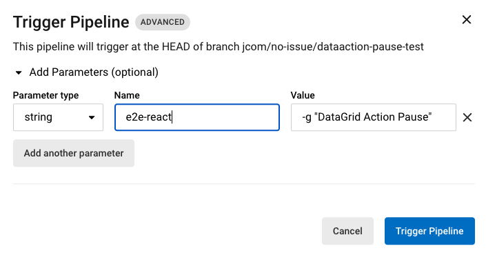

# E2E

Our goals are to keep test cases realiable, stable, maintainable, and readable.

## Framework

Determined AI uses [Playwright 🎭](https://playwright.dev/).

## Setup

Everything you need before running tests

**Before you follow the steps bellow, make sure that your VSCode is up-to-date, or you might face issues**

### `.env`

Create `.env` file in `webui/react` like `webui/react/.env` and env variables. (`PW_` prefix stands for Playwright)

- `PW_BASE_URL`: web server tests are pointing to, typically <http://localhost:3000> or <http://localhost:3001>
- `PW_USERNAME`: admin determined account creds
- `PW_PASSWORD`: admin determined account creds
- `PW_SERVER_ADDRESS`: API server address. defaults to base url
- `PW_DET_PATH`: path to `det`. defaults to `det`
- `PW_DET_MASTER`: used for CLI commands. defaults to <http://localhost:8080>
- `PW_EE`: flag for `ee` or `oss`. defaults to unset for oss

### Playwright

Run `npx playwright install`

### Determined

Pick between live and static

#### Live Changes

1. `npm run start` `--prefix webui/react`
2. `conda activate det &&` `make devcluster`

#### Static Build and Cluster Up

1. `det deploy local cluster-up --no-gpu --master-port=8080`
2. `SERVER_ADDRESS="http://localhost:3001" npm run build --prefix webui/react`
3. Optional `npm run preview --prefix webui/react` to run the preview app. Won't be used if `CI=true`.
4. To run the tests: `PW_BASE_URL="http://localhost:3001"  PW_USERNAME="admin" PW_PASSWORD="" npm run e2e --prefix webui/react`
   - Provide `-- -p=firefox` to choose one browser to run on. Full list of projects located in [playwright config](/webui/react/playwright.config.ts).

## Run Tests

Use the [VS Code extension](https://marketplace.visualstudio.com/items?itemName=ms-playwright.playwright) to run individual tests. You can also use the commandline, here are [the docs](https://playwright.dev/docs/running-tests).

## CI

CI is setup as `test-e2e-react` in `.circleci/config.yml`.

### Manual CI

Run individual tests on ci with `e2e-react` `-g [your test]`.

### Environment

We use `mcr.microsoft.com/playwright` for [docker container](https://playwright.dev/docs/docker).
Update the docker image version along with Playwright version.

- PW_DET_PATH=/tmp/venv/bin/det"
- PW_SERVER_ADDRESS=<http://localhost:3001>"
- PW_USER_NAME=admin
- PW_PASSWORD=
- PW_DET_MASTER=<http://localhost:8082>"
- DET_WEBPACK_PROXY_URL=<http://localhost:8082>"
- DET_WEBSOCKET_PROXY_URL=ws://localhost:8082"

## Appendix

- [Page model Readme](./models/README.md)
