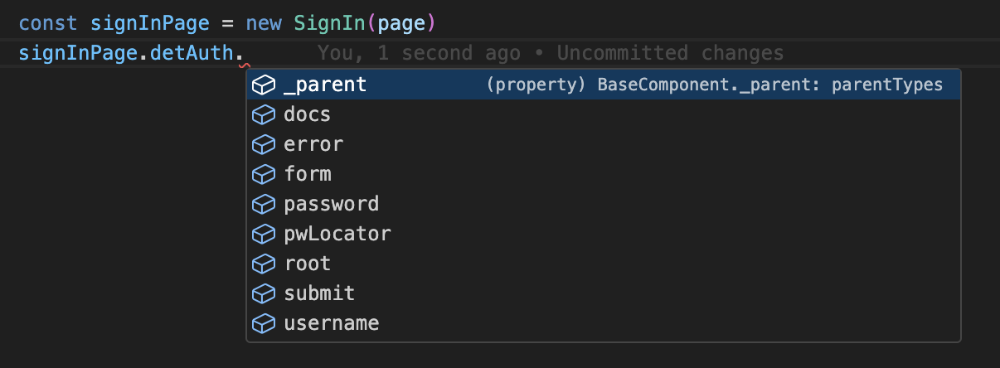
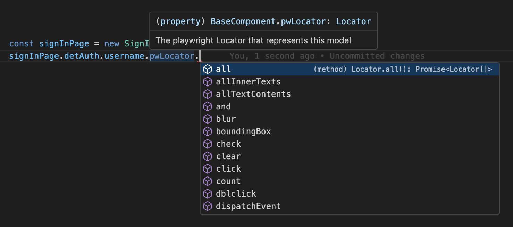

# Page Model Guide

Models represented in this folder are meant to be a one-to-one representations of objects from `src`.

- `src/pages/SignIn.tsx` -> `src/e2e/models/pages/SignIn.ts`
- `src/components/DeterminedAuth.tsx` -> `src/e2e/models/components/DeterminedAuth.ts`
- `src/utils/error.ts` -> `src/e2e/models/utils/error.ts`

Currently, there are subdirectories for `ant` and `hew` models, but we should have these directories moved to their own packages eventually.

## Why Page Models

Playwright has [a writeup](https://playwright.dev/docs/pom) on how page models are useful, namely that they can be used as an API for interacting with pages. While this is true, there is much more to be gained from using page models.

### What Playwright POM is Missing

The playwright API approach still loosely defines each component. Relying on text can be volitile, so it would be better to use accessibility or `data-test` attributes. Playwright POM also serves as an API rather than a **model**.

Most importantly, our page models are instaciated with `parent` elements. This enables us to build a chain of playwright locators one link at a time and mirror the UI implementation much more closely.

## How to use Page Models

Every test comes with a `page` object. Instantiate a page model importanting it and passing the `page` to its constructor. The page comes with more `readonly` properties which model the elements on the page. At any point in the chain, use the `pwlocator` propery to access a chain of playwright locators representing that model.

| Page model Autocomplete                                                 | Locator automcomplete                                             |
| ----------------------------------------------------------------------- | ----------------------------------------------------------------- |
|  |  |

### An Example from Auth Spec

```js
test('Expect submit disabled; Show multiple errors', async ({ page }) => {
  const signInPage = new SignIn(page);
  await signInPage.goto();
  await expect.soft(signInPage.detAuth.submit.pwLocator).toBeDisabled();
  await signInPage.detAuth.username.pwLocator.fill('chubbs');
  await signInPage.detAuth.submit.pwLocator.click();
  await signInPage.detAuth.submit.pwLocator.click();
  await expect(signInPage.detAuth.errors.close.pwLocator).toHaveCount(2);
});
```

## Types of Models

We want to model any part of the DOM that could be important to a test case. Typically, that means a `BasePage` will have a combination of `BaseComponents` and `NamedComponents` as child elements. This section will go over the different types of models.

### `BasePage`

Pages inherit from `BasePage`. It's the root of a component tree.

### `BaseComponent`

Base Components represent native react elements and containers.

Base components can still have child elements. All base components must be instanciated with a `selector` and a `parent`. Elements that extend from `BaseComponent` are typically defined as some variable, but aren't the top level element returned by the file.

- `Row`, `Tab`, `Item`
- `Dropdown`, `Select`, `Popover`, `Modal`
- `Header`, `Footer`

### `NamedComponent`

Named Components are similar to `BaseComponent`, but they represent the top level element returned by a component. Syntactically, this means they require a `readonly defaultSelector` property. There are three ways to instanciate a named component.

- parent (uses defaultSelector by default)
- parent and attatchment (`attatchment` appends to `defaultSelector`)
- parent and selector (just like `BaseComponent`, ignores `defaultSelector`)

### `BaseReactFragment`

Use `BaseReactFragment` instead of `NamedComponent` if the top level element is a react `React.Fragment`. Representing a react fragment with this class will preserve the parent locator heirachy while also providing a way to group elements, just like the React Fragments they model.

## Model Usage Example

This is an example of the action row on the admin user management page. Notice that all elements defined directly on `UserManagement.tsx` get their own test hooks and are represented by `BaseComponents`.

The only `NamedComponents` present in this example are the `InteractiveTable` and `SkeletonTable`. They define their test hooks in their own files, and so our models have thier `selector` defined as `defaultSelector` in their respective model files instead of being passed through the constructor.

Also notice, there are a few stylistic choices I made regarding `readonly #actionRow = new BaseComponent(...)`.

- First, I made it a private variable. This was to prevent test cases from accessing the model directly. For example, I wouldn't expect test authors to be clicking on the element or getting it's textContent. Instead, I would expect authors to be accessing one of it's child elements.
- Second, I could've written `readonly #actionRow = new ActionRow(...)` and `class ActionRow extends BaseComponent` into the file. These are both valid approaches, but the first one is easier and shorter at the cost of clarity. In a test scenario, this is the difference between accessing `userManagementPage.addUser` and `userManagementPage.actionRow.addUser`.

<!-- markdownlint-disable MD033 -->
<table>
<tr>
<td>

`src/pages/Admin/UserManagement.tsx`

</td>
<td>

`src/e2e/models/pages/Admin/UserManagement.ts`

</td>
</tr>
<tr>
<td>

```ts
<div className={css.actionBar} data-testid="actionRow">
  <Row>
    <Column>
      <Row>
        <Input data-testid="search"/>
        <Select data-testid="roleSelect"/>
        <Select data-testid="statusSelect"/>
      </Row>
    </Column>
    <Column align="right">
      <Row>
        {selectedUserIds.length > 0 && (
          <Dropdown menu={actionDropdownMenu}>
            <Button data-testid="actions">Actions</Button>
          </Dropdown>
        )}
        <Button data-testid="addUser">
          {CREATE_USER}
        </Button>
      </Row>
    </Column>
  </Row>
</div>
```

</td>
<td>

```ts
readonly #actionRow = new BaseComponent({
  parent: this.pivot.tabContent,
  selector: '[data-testid="actionRow"]',
});
readonly search = new BaseComponent({
  parent: this.#actionRow,
  selector: '[data-testid="search"]',
});
readonly filterRole = new RoleSelect({
  parent: this.#actionRow,
  selector: '[data-testid="roleSelect"]',
});
readonly filterStatus = new StatusSelect({
  parent: this.#actionRow,
  selector: '[data-testid="statusSelect"]',
});
readonly actions = new ActionDropdownMenu({
  childNode: new BaseComponent({
    parent: this.#actionRow,
    selector: '[data-testid="actions"]',
  }),
  root: this,
});
readonly addUser = new BaseComponent({
  parent: this.#actionRow,
  selector: '[data-testid="addUser"]',
});
```

</td>
</tr>
<tr>
<td>

```ts
{settings ? (
  <InteractiveTable<DetailedUser, UserManagementSettingsWithColumns> .../>
) : (
  <SkeletonTable />
)}
```

</td>
<td>

```ts
readonly table = new InteractiveTable({
  headRowType: UserHeadRow,
  parent: this.pivot.tabContent,
  rowType: UserRow,
});
readonly skeletonTable = new SkeletonTable({ parent: this.pivot.tabContent });
```

</td>
</tr>
</table>

<table>
<tr>
<td>

`src/components/Table/InteractiveTable.tsx`

</td>
<td>

`src/e2e/models/components/Table/InteractiveTable.ts`

</td>
</tr>
<tr>
<td>

```ts
return (
  <div data-test-component="interactiveTable">
    <Spinner spinning={!!spinning}>
      {spinning || !settings ? (
        <SkeletonTable />
      ) : (
        <Table data-testid="table" />
      )}
    </Spinner>
  </div>
);
```

</td>
<td>

```ts
export class InteractiveTable<
  RowType extends Row,
  HeadRowType extends HeadRow,
> extends NamedComponent {
  readonly defaultSelector = 'div[data-test-component="interactiveTable"]';
  constructor(args: TableArgs<RowType, HeadRowType>) {
    super(args);
    this.table = new Table({ ...args, attachment: '[data-testid="table"]', parent: this });
  }

  readonly table: Table<RowType, HeadRowType>;
  readonly skeleton = new SkeletonTable({ parent: this });
}
```

</td>
</tr>
</table>
<!-- markdownlint-enable MD033 -->

## Practices Around Test Hooks

When creating page models, you'll most likely want to author test hooks into the `src` components. Here's how.

| Test Hook Type                       | Usage                                                                                                                            |
| ------------------------------------ | -------------------------------------------------------------------------------------------------------------------------------- |
| `data-test-component='my-component'` | Belongs at the top level element wrapping the component                                                                          |
| `data-test='my-instance'`            | Attributed to any _instances_ of components or any intrinsic element                                                             |
| `data-test-id={something dynamic}`   | Test Hook for dynamic data. Consider having many `data-test='row'`s and looking for the attachemnt `data-test-id='my-test-user'` |

Not every component needs a data-test, but, in general, more is better. It's better to select for _"a duck named Hoffman"_ rather than "a duck" or "Hoffman". In situations where adding a top-level test hook (`data-test-component`) could be more trouble than it's worth, it's okay to use other unique identifiers, like `.ant-table`.

## Appenidx

### Appreciation and Inspiration

I'm writing as Justin Comins. The direction I took when developing this page model framework is what I believe to be the best that I can offer from the experience and intuition I gained from my time at Splunk. When I was working at Splunk, I used a special page model framework designed by my manager, George Louie (Glouie). The test framework used Python, Selenium, and a lot of custom packages to interact with Splunk. Selenium was flaky on it's own, so we wrapped the selenium elements with python classes.

Glouie's page models had a few important properties that I brought to this framework. Glouie's elements could all be instantiated with subelements, perfect for modeling complex component hierarchies. The component files had a 1-to-1 mapping with source code files. His framework achieved the same **maintainability** and **stability** as the components it modeled. Glouie instilled two other import characteristics into his framework in **reliability** and **readability**. Those two characteristics shone best through the plentiful error handling and messages through the rest of his framework, and I want to bring those characteristics to this framework as well!

I was very fortunate to have learned from Glouie and his framework, so I wanted to show my appreciation for him and for Splunk in this section. Thank you for being a great inspiration and mentor, Glouie!
